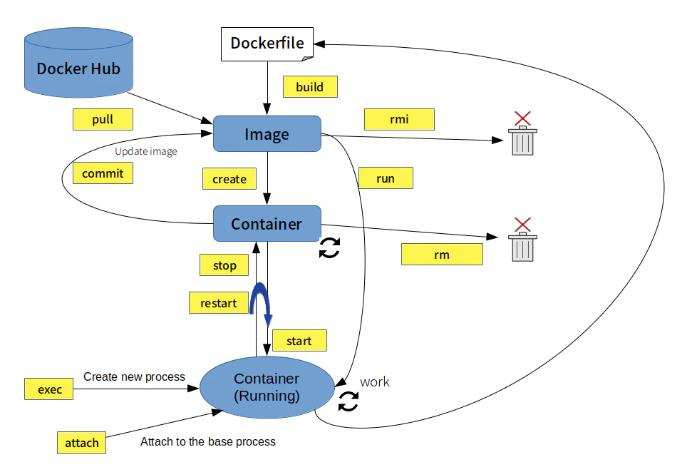

# Docker

[トップに戻る](../index.md)

## インストール手順

[Docker ドキュメント](https://docs.docker.com/engine/install/ubuntu/#install-using-the-repository) のインストール手順に従い、docker-ceをインストールする。  
なお、WSL2 へのインストール手順は、ネイティブLinuxへのインストール手順と同じ。

## Docker コマンド

Docker コマンドの一覧は以下の通り。[[1]](https://qiita.com/kattoyoshi/items/c6b731c7eff79becdc61#2-docker-%E3%82%B3%E3%83%9E%E3%83%B3%E3%83%89%E5%85%A8%E4%BD%93%E5%83%8F) [[2]](https://zenn.dev/wakkunn/articles/1db31632769ee2#%E3%82%B3%E3%83%B3%E3%83%86%E3%83%8A%E3%81%AE%E6%93%8D%E4%BD%9C)

### 全体像



### コマンド一覧

- image の操作
    - 【イメージ確認】 `docker images`
    - 【公開イメージ検索】 `docker search <image>`
    - 【公開イメージ取得】 `docker pull <image>[:<tag>]`
    - 【別名イメージ作成】 `docker tag <old_image> <new_image>[:<new_tag>]`
    - 【イメージ削除】 `docker rmi [opiton] <image1> <image2> ...`
    - 【イメージ全削除】 `docker image prune`
    - 【イメージ作成（コンテナから）】 `docker commit <container> <image>`
    - 【イメージ作成（Dockerfileから）】 `docker build -t <image>[:<tag>] <dockerfile_dir_path>`
    - 【イメージ作成（Dockerfileから）】 `docker build -t <image>[:<tag>] -f <dockerfile_path>`
- conteiner の操作
    - 【コンテナ一覧表示】 `docker ps [<option>]`
        - `-a` ：停止中コンテナも含む（ない場合は稼働中コンテナのみ）
    - 【コンテナ作成】 `docker create [<option>] <image>[:<tag>] [<command>]`
    - 【コンテナ起動】 `docker start [<option>] <container> [<container> ...]`
    - 【コンテナ停止】 `docker stop <container> [<container> ...]`
    - 【コンテナ再起動】 `docker restart <container>`
    - 【コンテナ作成＆起動】 `docker run [<option>] <image>[:<tag>] [<command>]`
        - `-d` (`--detach`) ：コンテナを生成し、バックグラウンドで実行する。
        - `-i` (`--interactive`) ：コンテナの標準入力を開く。
        - `-t` (`--tty`) ：端末デバイスを使う。（指定しない場合、キーボード入力を受け付けない）
        - `--name <container>` ：コンテナに名前をつける。（指定しない場合は、自動で付与される）
        - `--rm` ：コンテナ実行完了後にコンテナを自動で削除する。
            - 削除条件は以下のいずれか。
                - `exit` コマンドでコンテナから抜けた
                - `docker stop` でコンテナを停止した
        - `-u <user_name>` (`--user`) ：ユーザー名（または UID）を指定する。
        - `--add-host=<host_name>:<ip_address>` ：コンテナの /etc/hosts にホスト名とIPアドレスを定義する。
        - `-h` (`--hostname`) ：コンテナ自身のホスト名を指定する。（プロンプトにおける `user@host $` の "host"）
        - `-p <host_port>:<container port>` (`--publish`) ：ホストとコンテナのポートを紐づける。
        - `-e <env_var>=<value>` (`--env`) ：環境変数を設定する。
        - `-v <host_dir>:<container_dir>` (`--volume`) ：コンテナとホストのディレクトリをマウント（紐づけ）する。
        - `-w <dir_path>` (`--workdir`) ：コンテナの作業ディレクトリ（コンテナ接続時の起動ディレクトリ）を指定する。
        - `--pid=<name>` ：利用する PID 名前空間を指定する。
        - `--privileged` ：コンテナに対して全権限を与える。（カーネルに対して潜在的に危険になりうる処理も実行できる）
        - `--network <network_name>`  ：<network_name>ネットワークに接続する。
        - `--runtime <runtime_name>` ：コンテナー向けに利用するランタイムを指定する。
        - `--entrypoint <script_path>` ：イメージのデフォルト ENTRYPOINT を上書きする
    - 【コンテナ接続（新規プロセス起動）】 `docker exec [<option>] <container> <command>`
        - 以下のオプションは `run` と同様に使える。
            - `-d`、 `-i`、 `-t`、 `-e`、 `--privileged`、 `-u`、 `-w`
    - 【コンテナ接続（PID=1プロセス）】 `docker attach [<option>] <container>`
    - 【稼働コンテナ状況確認】 `docker status <container>`
    - 【稼働コンテナプロセス確認】 `docker top <container>`
    - 【コンテナ削除】 `docker rm <container>`
    - 【コンテナ全削除】 `docker container prune`
    - 【ファイルコピーtoコンテナ】docker cp [<option>] <src_path> <container>:<dest_path>
    - 【コンテナ/イメージ/ネットワーク等 全削除】 `docker system prune`
- その他
    - 【Docker使用量調査（全体）】 `docker system df`
    - 【Docker使用量調査（ボリューム毎の詳細）】 `docker system df -v`
    - 【ログ確認】 `docker logs`

## 実行例

- イメージ `ubuntu:22.04` からコンテナ作成＆接続を行う。

    ```shell
    docker run -it --rm --name Ubuntu22.04_container ubuntu:22.04 /bin/bash
    docker exec -it --rm Ubuntu22.04_container /bin/bash
    ```

## Tips

- [docker.ioとdocker-ceの違い](https://scrapbox.io/nabe-yu/docker.io%E3%81%A8docker-ce%E3%81%AE%E9%81%95%E3%81%84)
    - docker-ce：本家が提供するdocker-engine
        - ce＝コミュニティエディション
        - ee＝エンタープライズエディション
    - docker.io：Ubuntuが提供するdocker-engine
        - docker.ioはバージョンが本家に比べて古いことがあるので、  
        最新版を使いたければdocker-ceをインストールすることをお勧めする。
- [attach と execの違い](https://www.wantanblog.com/entry/2020/03/10/223050)
    - `attach`
        - 「PID=1」で起動しているプロセスに接続する。  
        - exitコマンドでシェルを終了するとコンテナが停止する。
    - `exec`
        - プロセスを新たに生成して接続する。（/bin/bash 等）
        - exitコマンドでシェルを終了するとコンテナが停止しない。
- [コンテナを抜ける方法](https://qiita.com/Statham/items/c204e85067ea4dca2724)
    - 以下のいずれかを行う。
        - `exit` コマンド実行
            - →コンテナ自体が終了
        - `ctrl + p` -> `ctrl + q` 押下
            - →起動させたままコンテナから抜ける。(＝デタッチ)
- [Docker Composeとは？](https://knowledge.sakura.ad.jp/16862/)
    - 複数のコンテナで構成されるアプリケーションについて、Dockerイメージのビルドや各コンテナの起動・停止などをより簡単に行えるようにするツール
- [新旧Dockerコマンドについて](https://www.kagoya.jp/howto/rentalserver/dockercommand/)
    - Dockerでは、2017年1月にv1.13がリリースされてから、コマンドラインの命令体系が再編成された。  
    （Dockerのコマンドが増え過ぎたことから、整理して使いやすくするのが目的）  
    新しいコマンドラインでは、「何に対して」コマンドを実行するかを明示する。
        - 例）`docker run` → `docker container run`
- [docker runの-itオプションの意味](https://zenn.dev/swata_dev/articles/2f85a3f4b3022c#%E3%81%9D%E3%82%8C%E3%82%92%E8%B8%8F%E3%81%BE%E3%81%88%E3%81%A6)
	- コンテナに割り当てた偽のデバイスファイル名を指名(`-t`)して、こちら(本デバイス)の標準入力をコンテナに伝えられるようにする(`-i`)。

## トラブルシューティング

- Docker デーモンが起動しないエラーについて
    - 事象：WSL2へインストールした直後のDocker コマンド実行時に、以下のエラーが発生してDockerコマンドを実行できないことがある。

        ```shell
        Cannot connect to the Docker daemon at unix:///var/run/docker.sock. Is the docker daemon running?
        ```

    - 対処法１：サービスを開始する。

        ```shell
        sudo service docker start
        ```

    - 対処法２：dockerグループへ参加してWSL2を再起動する。

        ```shell
        sudo usermod -aG docker $USER
        wsl --shutdown
        ```

    - 対処法３：[ディストリビューションのバージョンを1から2にアップデートする。](https://qiita.com/matarillo/items/98d7452967987fe5d633)

[トップに戻る](../index.md)
