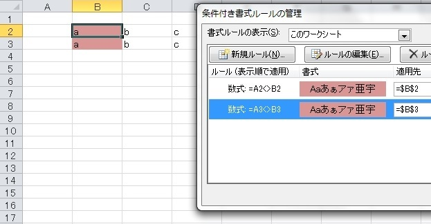
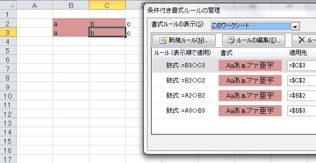
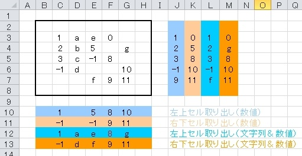
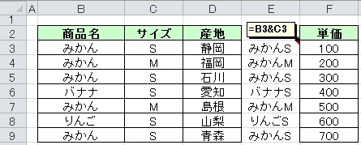
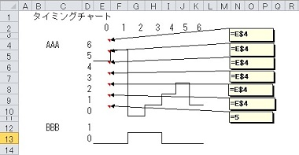
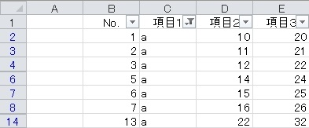
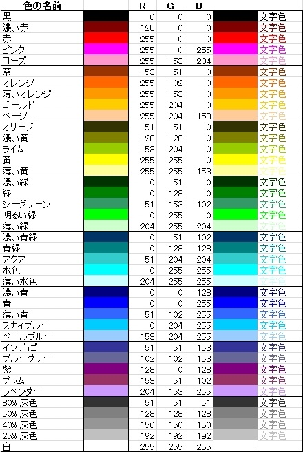
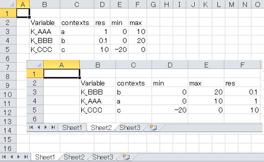
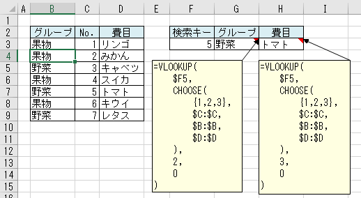

# Excel

[トップに戻る](../index.md)

## 設定

- IME ON 時に行選択ショートカット (Shift+Space) を効くようにする ＠Windows7
    - IME の「設定」→「全般」タブで "Microsoft Office IME 2010" を選択し、「プロパティ」を押下
    - 「全般」タブの「キー設定」の「変更」を押下
    - 「キー設定」タブの "Shift+SPACE" の "入力/変換済み文字なし" を 「-」に変更
- 列非表示のショートカットが効かない！
    - Win-R ⇒ 「intl.cpl」を実行
    -「キーボードと言語」→「キーボードの変更」
    -「詳細なキー設定」→「キーシーケンスの変更」
    -「キーボードレイアウトの切り替え」を "割り当てなし" に変更
- ヘルプがうまく検索されない！ @Excel2010
    - 原因:
        - F1 を押して検索されない場合、デフォルトでオンラインのヘルプを参照しに行こうとしている。
    - 解決策：
        - F1を押してヘルプを表示
        - 右下の「Office.comに接続」をクリック
        - 「このコンピュータ上のコンテンツのみを表示」にチェック
- F1を押してもヘルプが表示されないようにする
    - 【方法１】レジストリ変更
        - レジストリエディタ(regedit) にて以下を作成する。(もとに戻す場合は以下を削除)
            - path：HKEY\_CURRENT\_USER\Software\Policies\Microsoft\Office\＜バージョン＞\Excel\DisabledShortcutKeysCheckBoxes
            - Name：F1Key (任意)
            - Value：112,0

                | Office | バージョン|
                |:---|:---|
                | 2016 | 16.0 |
                | 2013 | 15.0 |
                | 2010 | 14.0 |
                | 2007 | 12.0 |

    - 【方法２】アドインを使用
        - 「F1のヘルプを無効に」にてインターネット検索し、インストールする。
        - アドイン内で上記のレジストリ設定をしていると思われるが、設定が楽なので一番おすすめ！
    - 【方法３】マクロ使用
        - 「マクロの保存先(I)」を「個人用マクロブック」として、「新しいマクロの記録(R)」を開始
        - ストップボタンを押して、「記録終了（R)」
        - 作成された PERSONAL.XLS に以下を記入。(Macro1() を auto\_open() に変更)
        - この方法だと、他プロセスで Excel を起動した際、新プロセス側では F1 ヘルプが効いてしまう！

            ```vba
            Sub auto_open()
                ' ヘルプキー無効化
                Application.OnKey "{F1}", ""
            End Sub
            ```

- Excel のデフォルト保存先変更
    - ファイル->オプション->保存->既定のファイルの場所 を変更
- リボンに設定
    - 枠なし
    - 格子
    - 外枠太罫線
        - <区切り>
    - 中央揃え
        - <区切り>
    - セルを結合して中央揃え
    - 横方向に結合
    - 選択範囲内で中央（マクロ：CenterAcrossForSelectionCell）
        - <区切り>
    - 分割
    - シート名の変更
        - <区切り>
    - 連続データ
        - <区切り>
    - 塗りつぶしの色（2003）
    - フォントの色（2003）
    - 線の色（2003）
        - <区切り>
    - 塗りつぶしの色（2010）
    - フォントの色（2010）
    - 線の色（2010）
        - <区切り>
    - 枠線の表示
    - 条件付き書式
    - 区切り位置
    - 名前の管理
    - オブジェクトの選択
- アニメーション効果をオフ
    1. 「オプション」→「簡単操作」→「操作の結果のオプション」
    1. 「操作をアニメーションで表示する」をオフ
- セルに文字入力する際、続きが勝手に入力されるのを止める
    - 「オプション」→「詳細設定」→「編集オプション」
    1. 「オートコンプリートを使用する」のチェックを外す
- 英単語の先頭文字が自動的に大文字になるのを防ぐ
    1. 「オプション」→「文章校正」→「オートコレクトのオプション」
    1. 「文の先頭文字を大文字にする」をオフ
- 「デスクトップ右クリック時のExcelファイルを新規作成する」における初期状態を変更する＠Excel2016
    1. 初期状態にしたいエクセルファイルを作成する
    1. 以下に格納する
        - C:\Program Files (x86)\Microsoft Office\root\vfs\Windows\SHELLNEW\EXCEL12.XLSX
- EXCEL.EXE 格納先
    - 2016
        - C:\Program Files (x86)\Microsoft Office\root\Office16\EXCEL.EXE
- [テンプレートファイル（デフォルトブック）作成方法](https://www.tekizai.net/entry/excel_template_1)
    - 作成方法
        1. テンプレートに設定したいExcelファイルを*.xlsx形式で作成する。
        1. Excel上で `F12` を押下し、テンプレートファイルとして保存する。
            - ファイル名
                - `Book.xltx`
            - 格納先
                - Excel 2016より前：`%USERPROFILE%\AppData\Roaming\Microsoft\Excel\XLSTART`
                - Excel 2016： `C:\Program Files (x86)\Microsoft Office\root\Office16\XLSTART`
    - 適用タイミング
        - Explorerの右クリックから新規作成時？
            - Excel上での新規ブック/シート作成時は本テンプレートは使用されない。
- [アドインマクロに電子署名を付与する方法](https://www.teijitaisya.com/vba-selfcert/)

## アドイン登録方法

- .xlaを以下に登録
    - C:\Users\[ユーザ名]\AppData\Roaming\Microsoft\AddIns
- Excel を起動、「開発」タブ⇒「アドイン」にて「有効なアドイン」に登録

## アドイン集

- OfficeTab
- Vimxls
- Excel2003ColorPalletKai
- F1のヘルプを無効に

## Tips

- 別プロセス起動(別インスタンス起動)
    - “ファイル名を指定して実行”から「excel /x」を実行
    - altを押しながらexcelを起動
- テキストボックスにセルの内容を表示する
    - テキストボックスを選択し、"数式バーに"表示したいセル番号を記述する ex) =A1
- 離れたセルを複数選択
    - Shift - 矢印キーにて複数選択 ⇒ Shift - F8 押下後 ⇒ 再度複数選択
- 条件付き書式のコピーの挙動
    - 図１：書式コピー前
    - 図２：書式コピー後
    - 2行目：B2 標準コピー⇒ C2 書式ペースト のパターン
    - 3行目：B3 書式コピー⇒ C3 書式ペースト のパターン
        - 【考察１】「書式コピー」も「標準コピー」も貼り付け後の結果は変わらない。
        - 【考察２】書式ペーストを行うと、条件付き書式ルールが複製されてしまう。


- 空白以外の最端セル取り出し
    - 【最左上セル取り出し（数値）】`IF( COUNT( B2:H2 ) = 0, "", &font(red){INDEX( B2:H2, MATCH( 0, INDEX( 0/B2:H2, ), ) )} )`
    - 【最右下セル取り出し（数値）】`IF( COUNT( B2:H2 ) = 0, "", &font(red){LOOKUP( 10^10, B2:H2 )} )`
    - 【最左上セル取り出し（文字列＆数値）】`IF( COUNTIF( B2:H2, "<>" ) = 0, "", &font(red){INDEX( B2:H2, MATCH( 1, INDEX( 1/( B2:H2 <> 0 ), ), 0 ) )} )`
    - 【最右下セル取り出し（文字列＆数値）】`IF( COUNTIF( B2:H2, "<>" ) = 0, "", &font(red){LOOKUP( 1, 0/( B2:H2 <> "" ), B2:H2 )} )`
        - ただし、最左上セル取り出しは"0"を検索対象として見なさない

- 空白以外の最端セル取り出し（ExcelVBA）
    - 【最右下セル取り出し】`Evaluate("INDEX(セル範囲,MATCH(""\*"",セル範囲,0))")`
    - 【最左上セル取り出し】`Evaluate("INDEX(セル範囲,MATCH(""\*"",セル範囲,-1))")`
- 条件検索関連
    - 複数条件 加算
        - `=SUMPRODUCT( ( ( $B:$B="みかん" ) \* ( $C:$C="M" ) ), $F:$F )`
    - 複数条件 検索（SUMPRODUCT）
        - `=INDEX( $F:$F, SUMPRODUCT( ( $B:$B="みかん" ) \* ( $C:$C="M" ) \* ROW( $A:$A ) ) )`
            - なぜかうまく検索できないことがあるため、使用しないこと。。
    - 複数条件 検索（VLOOKUP）
        - `=VLOOKUP( "みかん"&"M", $E:$F, COLUMNS( $E:$F ) )`
    - 条件付き 最大値
        - `=SUMPRODUCT( MAX( ( $B$3:$B$9="みかん" ) \* ( $C$3:$C$9="M" ) \* ( $F$3:$F$9 ) ) )`
            - 注意１：列選択はできない。
            - 注意２：最小値の算出はできない。（条件に合わないものは「0」となり、他の数値よりもっとも小さくなるので）

- 重複データの連番
    - countif 関数の範囲にて、末尾行のみ相対参照にする
        - `=COUNTIF( $B$1:$B3, $B3 )`
- ビットシフト
    - `1 \* 2^8` ⇒ 1 を左 8 ビットシフトさせる
    - （階乗を利用する。ex. a^b ⇒ a の b 乗）
- 行・列の上限を縮める
    - 行の上限を 65535 から 50 行まで縮めたい場合、51 行目から 65535 行目まで選択し非表示とすることで、行上限が縮まったように見える。
- 非表示行・列を探索する
    - 全行の特定の列(※)に値を格納する。
    - 全行に「`=AGGREGATE(3,5,<※セル指定>)`」を指定する。
    - 非表示行が 0、表示行が 1 となる。
- 「名前の定義」で同じシートのセルに対して参照する方法
    - `!$C$100`
- コピー＆行挿入ペースト時に条件付き書式のゴミが作成される対策
    - 行挿入後、「コピー元の行を含めて」行ペーストする。
    - 列も同様。
- 末尾の単語を取得する
    - `CLEAN(RIGHT(SUBSTITUTE(A1,"\",REPT(CHAR(9),200)),200))`
    - 解説）デリミタ"\"を「200文字の制御文字CHAR(9)」で置換し、文字列の末尾200文字を取得する。
- 分数の入力方法
    - セル入力時 "0 1/2"と入力する
- 複数列を一列に展開する方法
    - Excel の範囲をコピーしテキストエディタに貼り付け後、タブを改行に変換する。
- セル内の改行を別の文字列へ変換
    - 置換ウィンドウの「検索する文字列」に "Ctrl+I（大文字アイ）"を入力して置換。
- タイミングチャート用条件付き書式（添付の「タイミングチャート例.xls」参照）
    - 書式条件１
        - 条件式：`=AND( E4<>"", F4<>"", OR( AND( E4<F4, $D4>=E4, $D4<F4 ), AND( E4>F4, $D4<E4,  $D4>=F4 ) ) )`
        - 適用範囲：`=$E$4:$O$14`
        - 書式：右縦 罫線
    - 書式条件２
        - 条件式：`=AND( E4<>"", $D4=E4)`
        - 適用範囲：`=$E$4:$O$14`
        - 書式：下 罫線


- 非表示セルへの貼り付け動作について
    - 実験目的
        - セルの貼り付け時、非表示となっているセル（フィルタ時、行/列非表示時）に対して貼り付けされてしまう場合がある。
        - その動作を実験し、考察する。（図は例図、表は実行結果）
    - 結論
        - 単一セル貼り付け以外は非表示セルに貼り付けされてしまうため、フィルタ後の貼り付けは「単一セル貼り付けのみ」を使用すること。
            

            | パターン | コピー元 | ペースト先 | 可視セルのみ貼り付け |
            |:---|:---|:---|:---|
            | 単一セル | D2 | E4:E6 | ○ |
            | 複数列選択時 | D2:E2 | D4:E6 | × |
            | 複数行選択時 | B4:B6 | E4:E6 | × |
            | 単一セル（形式選択貼付） | D2 | E4:E6 | × |

- 大量データでの高速VLOOKUP

    ```txt
    =IF(
        INDEX(
            Sheet1!$A$1:$B$200000,
            MATCH(
                $A1,
                Sheet1!$A$1:$B$200000,
                1
            ),
            1
        )=$A1,
        VLOOKUP(
            $A1,
            Sheet1!$A$1:$B$200000,
            2,
            TRUE
        ),
        NA()
    )
    ```

- Excel 2003 カラーパレット

- セル内の改行について
    - セル内の改行コードは LF (CHAR(10))である。
    - そのため、VBA から vbNewLine（CRLF） 指定で改行すると、見えない改行（CR）が挿入される
    - CR が挿入された場合、 `=SUBSTITUTE(A1,CHAR(13),"")` で置換すれば見えない改行は消える。
- 表示形式

    | 値 | =TEXT($B4,0x00000000) | =TEXT($B4,0x########) | =TEXT($B4,0.000) | =TEXT($B4,000,000) |
    |:---|:---|:---|:---|:---|
    | 1 | 0x00000001 | 0x1 | 1.000 | 000,001 |
    | 23 | 0x00000023 | 0x23 | 23.000 | 000,023 |
    | 2230 | 0x00002230 | 0x2230 | 2230.000 | 002,230 |
    | 012 | 0x00000012 | 0x12 | 12.000 | 000,012 |
    | 2222222 | 0x02222222 | 0x2222222 | 2222222.000 | 2,222,222 |
    | 222222222 | 2x22222222 | 2x22222222 | 222222222.000 | 222,222,222 |

- R1C1 アクセス方法
    - `B2 ⇔ INDIRECT( "R2C2" , FALSE )`
    - `INDIRECT( "R" & ROW() & "C" & COLUMN() , FALSE )`
- countif 使用例
    - `=COUNTIF($B3,"\*世田谷区\*")`
    - `=COUNTIF($A$1,"<>検索文字列")`
    - `=COUNTIF($A$1,">=4")（>,>=,<,<=）`
- ファイルパスからファイル名を取得
    - `=splitstr(B2,"\",getstrnum(B2,"\"))`
        - ただし、UserDefFunc.xla をインストールしておく必要あり！
- 行数が違う複数シートに共通の言葉を追加する方法（ [[置換例]] 参照）
    - 複数シートを選択
    - E 列に数式を挿入
        - `E3` = `IF( B3<>"", D3&"[-]", "★★★" )`
    - E 列をコピーして、D 列に値コピー
    - 「★★★」を「」に置換（置換オプションは以下を指定）
        - 「セル内容が完全に同一であるものを検索する」
        - 検索場所「シート」
- vlookup＋match 関数活用法
    - vlookup 参照元と参照先の列順が異なっている場合でも、値が取得できる。
        - `Sheet2!C3` = `VLOOKUP( $B3, Sheet1!$B:$F, MATCH( C$2, Sheet1!$B$2:$F$2, 0), FALSE )`

- [先頭列以外を検索対象列としたvlookup](https://www.lifehacker.jp/amp/2020/08/217304_3-crazy-excel-formulas-that-do-amazing-things.html)
    - `VLOOKUP(<検索キー>,CHOOSE({1,2,3},$C:$C,$B:$B,$D:$D),3,0)`

- 「既定の図形に設定」について
    - 既定の図形に設定すると、設定したブック内で有効になる
    - Excel を終了しても、保存される
    - 別ブックでは適用されない
    - 類似の図形も適用される。
    - テキストの配置（左詰めや上詰めなど）は保存されない
- 数式のデバッグ方法
    - セル選択中に「F2」を押してテキスト編集モードにする。
    - デバッグしたい箇所を選択して「F9」を押すと計算結果に展開される。
- 条件付き書式増殖の条件
    - 添付の「条件付き書式増殖の条件.xlsm」参照
- ハイパーリンク関数
    - シート内のセルにジャンプ
        - `=HYPERLINK("#C5","C5セルにジャンプ！")`
    - ハイパーリンクのジャンプ先を可変にする方法
        - HYPERLINK 関数に加えて ADDRESS 関数＋MATCH 関数を組み合わせる！詳細は以下URL参照。
            - <http://maigo-pg.seesaa.net/article/293396199.html>
- 【hyperlink関数】HYPERLINK(<リンク先>,<表示文字列>)
    - 【hyperlink関数（同シート）】`HYPERLINK("#A1","⇒")`
    - 【hyperlink関数（別シート）】`HYPERLINK("#Sheet1!A1","⇒")`
    - 【hyperlink関数（別ブック絶対パス１）】`HYPERLINK("[C:\test\test.xlsx]Sheet3!A1","⇒")`
    - 【hyperlink関数（別ブック絶対パス２）】`HYPERLINK("C:\test\test.xlsx","⇒")`
    - 【hyperlink関数（別ブック相対パス１）】`HYPERLINK(".\test\test.xlsx","⇒")`
    - 【hyperlink関数（別ブック相対パス２）】`HYPERLINK("..\test\test.xlsx","⇒")`
- Excel ２プロセス同時起動
    - コマンドプロンプトにて以下を実行
        - 例１）`"C:\Program Files (x86)\Microsoft Office\Office14\EXCEL.EXE" /x`
        - 例２）`"C:\Program Files (x86)\Microsoft Office\Office14\EXCEL.EXE" /x c:\test\test.xlsx`
- 時刻を時間に変換する方法（ex.8:15→8.25）
    - `=B4\*24（表示形式：標準、B4は時刻が入力されているセル）`
- 数式を文字列として返す関数＠Excel2013以降
    - `FORMULATEXT()`
- [pdfから表を取り出してexcelに貼り付け](https://www.atmarkit.co.jp/ait/articles/2002/27/news011.html#utm_medium=email&utm_source=ait-tsushin&utm_campaign=20200304)
- ポイント/ピクセル違い
    - 列幅
        - 文字数(pixel)
    - 行高さ
        - point(pixel)
- 数式ネストテンプレート

    ```txt
    =IF(
        A1="",
        "",
        IF(
            B1="",
            "",
            IF(
                C1="",
                "",
                IF(
                    D1="",
                    "",
                    ""
                )
            )
        )
    )

    IF(
        A1<>"",
        IF(
            B1<>"",
            IF(
                C1<>"",
                IF(
                    D1<>"",
                    "",
                    ""
                ),
                ""
            ),
            ""
        ),
        ""
    )
    ```

- 切り捨て,切り上げ,四捨五入
    - TRUNCとROUNDDOWNの違いは、桁数指定省略有無のみ

        |数値|桁数|INT(数値)|TRUNC(数値[,桁数])|ROUNDDOWN(数値,桁数)|ROUNDUP(数値,桁数)|ROUND(数値,桁数)|
        |:--:|:--:|:--:|:--:|:--:|:--:|:--:|
        |-|-|切捨て|切捨て|切捨て|切上げ|四捨五入|
        | 10.5 | 0 | 10.0 | 10.0 | 10.0 | 11.0 | 11.0 |
        | 10.4 | 0 | 10.0 | 10.0 | 10.0 | 11.0 | 10.0 |
        | -10.4 | 0 | -11.0 | -10.0 | -10.0 | -11.0 | -10.0 |
        | -10.5 | 0 | -11.0 | -10.0 | -10.0 | -11.0 | -11.0 |
        | 10.15 | 1 | 10.00 | 10.10 | 10.10 | 10.20 | 10.20 |
        | 10.14 | 1 | 10.00 | 10.10 | 10.10 | 10.20 | 10.10 |
        | -10.14 | 1 | -11.00 | -10.10 | -10.10 | -10.20 | -10.10 |
        | -10.15 | 1 | -11.00 | -10.10 | -10.10 | -10.20 | -10.20 |

- テーブルのメリットデメリット
    - ◯：テーブル毎にフィルタをかけられる
    - ◯：行毎の書式変更が自動的にできる
    - ◯：セル参照時に見やすい
    - ◯：条件付き書式が壊れない
    - ○：書式設定が楽
    - ○：行や列を追加しても、シート全体の行列は挿入されない
        - メリットでもデメリットでもある
    - ×：キー操作で行列挿入しづらい
        - 複数回選択キーを入力すれば選択できる
    - ×：行や列を追加しても、シート全体の行列は挿入されない
    - ×：タイトル行を複数にできない
    - ×：セルを結合できない

- 再計算について
    - [再計算設定の保存について](https://www.atmarkit.co.jp/ait/articles/2002/13/news008.html)
        - 「計算方法の設定」はブックに保存可能。
        - 次回Excel起動時の計算方法は起動時に読みだしたブックの設定方法に固定される。

            | ブック種別       | Excel起動直後 | 2つ目に開いたブックが手動モード | 2つ目に開いたブックが自動モード |
            |:----------------:|:-------------:|:-------------------------------:|:-------------------------------:|
            | 新規ブック       | 自動          | 自動                            | 自動                            |
            | 手動モードブック | 手動          | 手動                            | 手動                            |
            | 自動モードブック | 自動          | 自動                            | 自動                            |

    - 再計算の種類

        | ショートカットキー                   | 対象                   | 再構築（強制的な再計算） | リボン                          |
        |:------------------------------------:|:----------------------:|:------------------------:|:-------------------------------:|
        | ［F9］                               | 開いている全てのブック | ×                       | ［数式］タブ－［再計算実行］    |
        | ［Shift］＋［F9］                    | アクティブシート       | ×                       | ［数式］タブ－［シート再計算］  |
        | ［Ctrl］＋［Alt］＋［F9］            | 開いている全てのブック | ○                       | なし                            |
        | ［Ctrl］＋［Alt］＋［Shift］＋［F9］ | アクティブブック       | ○                       | なし                            |

- ユーザー設定のビュー
    - リボン[表示]タブ → [ユーザー設定のビュー]
- 「既定の図形を設定」の特徴
    - 適用範囲は"ブック単位"
    - 設定はファイルを閉じても"保存"される
    - 設定したブックを含むシートを別ブックにコピーしても、コピー先には適用されない
- visio オブジェクト貼り付け
    - visio をインストールしていないPCで、visio オブジェクトが貼り付けられた excel ファイルを開くと、visioオブジェクトを表示できるか？
        - できる
- [DGET関数](https://kokodane.com/kansu_database_04.htm)
    - vlookup関数の代替になりうる！
- [エクセル パスワードを忘れた場合の対処法](https://www.passfab.jp/excel/forgot-excel-file-password.html)
- アウトライン設定保存状態
    - シートコピー時：保存される
- ショートカットキーで選択範囲を解除できる
    - shift+backspace
- [ステータスバーの合計値などをクリックするとコピーできる](https://forest.watch.impress.co.jp/docs/news/1394326.html)
- [F4 キーで繰り返せる動作](https://dengekionline.com/articles/53028/)
    - 背景/フォント色変更
    - フォントサイズ変更
    - 罫線追加/削除
    - 行/列の挿入/削除
    - 書式設定変更
    - 等…
- [Excel API](https://excelapi.org/docs/)
    - Excel用のWeb API
    - 以下のように使用する。
        - i.e. 祝日の一覧を取得する
            - `=WEBSERVICE("http://api.excelapi.org/datetime/holiday-list?year="&B$1&"&line="&$A2)`
- 挿入した画像の横幅が勝手に変わる
    - 対策：[既定のフォントを変える](https://grum.hatenablog.com/entry/2017/06/13/020000)
- #を含むファイルパスへのハイパーリンクでジャンプできない
    - 対策：以下の数式を使って、"#"をURIエンコードしたものをリンク先とする。
        - `HYPERLINK("file:///"&SUBSTITUTE("path", "#", "%23%"),"リンクはこちら")`
- フォント/フォントサイズのデフォルト値
    - Excel上で新規ブック作成時(`ctrl + n`)
        - Excel上の設定値（Excel上の「オプション」→「全般」→「新しいブックの作成時」）
    - Excel上で新規シート作成時(`shift + f11`)
        - Excelブックに保存されたデフォルト設定値
            - ＝新規ブック作成時に設定されていたExcel上の設定値
    - Explorerの右クリックから新規作成時
        - ★テンプレートファイル？
- Excelに埋め込んだVisioオブジェクトを編集できない。
    - 事象
        - Excelに埋め込んだVisioオブジェクトは、「オブジェクトを右クリック」->「Visio オブジェクト(O)」->「開く(O)」で編集できる。  
        しかし、右クリック時のコンテキストメニューに「Visio オブジェクト(O)」が表示されないことで、編集できないことがある。
    - 対処方法
        - Visioオブジェクトをダブルクリックして、一度Visioオブジェクトを直接編集する。  
        それにより、右クリック時のコンテキストメニューに「Visio オブジェクト(O)」が表示されるようになる。
- Excel内のオブジェクトが表示されない。
    - 原因
        - 何かの拍子に、オブジェクトの非表示設定されたため
    - 対処方法
        - `Ctrl + 6`を押下して、オブジェクト表示/非表示を切り替える

## ショートカットキー

### 右クリック

- 【右クリック→E→V】選択セルの値でフィルタ絞り込み

### ホットキー

|Ctrl|Shift|Alt|Key|機能|
|:---|:---|:---|:---|:---|
||||F4|直前の操作を繰り返す|
||||F4|【文字入力時】相対参照⇔絶対参照|
||||F5|ダイアログボックス表示 [ジャンプ]|
||||F6|各ペインにフォーカスを当てる|
||||F7|ダイアログボックス表示 [スペルチェック]|
||||F12|名前を付けて保存|
||||F2 ⇒ F9|数式→値 変換|
||||F2|【数式入力時】編集モード⇔入力モード切替|
||||ScrollLock+方向キー|スクロールバー移動|
|Ctrl|||t|テーブル挿入|
|Ctrl|||1|ダイアログボックス表示 [セルの書式設定]|
|Ctrl|||6|オブジェクト 表示/非表示 切り替え|
|Ctrl|||8|アウトライン記号 表示/非表示 切り替え|
|Ctrl|||F3|ダイアログボックス表示 [名前の管理]|
|Ctrl|||\||選択行内のアクティブセル値不一致セルを選択|
|Ctrl|||Delete|【値入力時】行末までテキスト削除|
||Shift||F4|次の空白へジャンプ|
||Shift||F8|選択範囲の追加/削除|
||Shift/||F9|再計算（シート/ブック 変更セルのみ）|
||Shift||F11|新規シートの挿入|
|||Alt|F1|現在の範囲からグラフを作成|
|||Alt|F8|ダイアログボックス表示 [マクロ]|
|||Alt|PageUp(Down)|一画面分左に(右に)横スクロール|
|||Alt|←/→|ハイパーリンクジャンプ 戻る/進む|
|Ctrl|/Shift||9|選択行を非表示/表示|
|Ctrl|/Shift||0|選択列を非表示/表示|
|Ctrl|Shift||5|表示形式 [%]|
|Ctrl|Shift||3|表示形式 [日付]|
|Ctrl|Shift||^|表示形式 [標準]|
|Ctrl|Shift||:|アクティブ セル領域 (アクティブ セルを含み、空白の行と列で囲まれているデータ領域) を選択|
|Ctrl|Shift||@|表示切替 値⇔数式|
|Ctrl|Shift||o|コメントが入力されている全セル選択|
|Ctrl|Shift||u|数式バー 展開/折りたたみ|
|Ctrl|Shift||p|ダイアログボックス表示 [セルの書式設定]|
|Ctrl|Shift||F3|選択セルから名前付き範囲を作成|
||Shift|Alt|=|オートSUM機能|
||Shift|Alt|→/←|グループ化/グループ化解除|
||Shift|Alt|7|ブックのスタイルを設定|
|Ctrl||Alt|v|ダイアログボックス表示 [形式を選択して貼り付け]|
|Ctrl||Alt|F9|再計算（全シート全セル）|
|Ctrl|Shift|Alt|F9|再計算（参照先の数式を含め全シート全セル）|

### ALTキー

| Key | 機能 |
|:---|:---|
|HFF|[セル書式] [フォント] フォント変更|
|HFS|[セル書式] [フォント] サイズ変更|
|HF1|[セル書式] [フォント] カラー変更|
|HH|[セル書式] [セル] 背景色変更|
|HW|[セル書式] [文字配置] 折り返して全体を表示|
|H&color(red){L1} / HAC / H&color(red){R}|[セル書式] [文字配置] 左 / 中央 / 右|
|HAT / HAM / HAB|[セル書式] [文字配置] 上 / 中央 / 下|
|HBN / HBA / HBT|[セル書式] [罫線] なし / 格子 / 太外枠|
|HMM / HMC / HMA / HMU|[セル書式] [セル結合] 結合 / 結合(中央) / 結合(横方向) / 解除|
|H0(zero) / H9|[セル書式] [小数点以下の表示桁数] ＋＋ / －－|
|EAR / EAH|[セル書式] [ハイパーリンク] 削除 / クリア|
|OD|[セル書式] [条件付き書式] ダイアログ表示|
|RH1|[セル書式] [コメント] 表示 / 非表示|
|WFF|[シート表示] ウィンドウ 枠固定 切り替え|
|WVG|[シート表示] 枠線 表示 / 非表示|
|HOI / HOA|[シート表示] 列 / 行幅 自動調整|
|HOT|[シート操作] 見出し色|
|OHH / OHU|[シート操作] 非表示 / 表示|
|EL|[シート操作] 削除|
|EM|[シート操作] 移動orコピーダイアログ|
|HOR|[シート操作] 名前変更|
|IB|[シート表示] 改ページ挿入|
|AE|[データ] [区切り位置] ダイアログ|
|AH / AJ|[データ] [グループ] 折りたたむ / 展開|
|AM|[データ] 重複削除|
|DL|[データ] [入力規則] ダイアログ|
|EIS|[データ] [連続データ表示] |
|HFDO|[ツール] オブジェクト選択|
|MV|[ツール] 数式の検証|
|RU2|[ツール] ブック共有|
|DFS|[ツール] [フィルタ] クリア適用|
|MP|[ツール] [トレース] 参照元トレース|
|MD|[ツール] [トレース] 参照先トレース|

[トップに戻る](../index.md)
