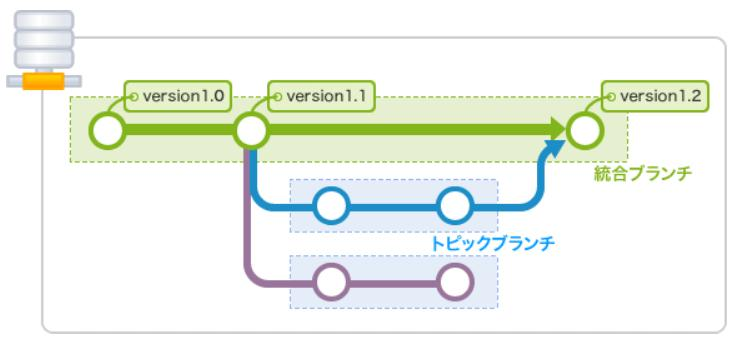
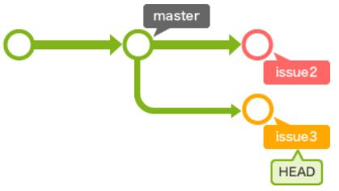
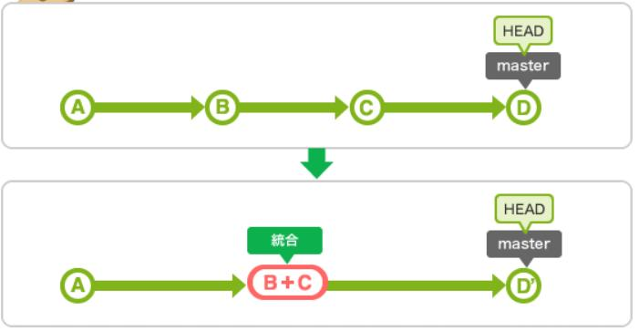
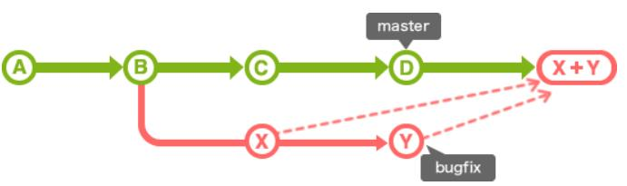
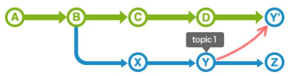
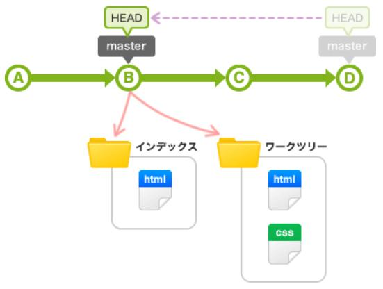
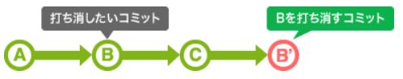
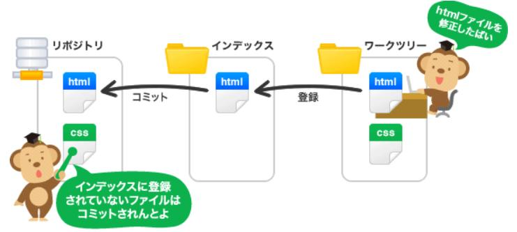
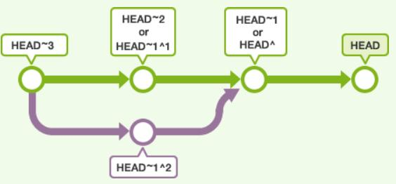
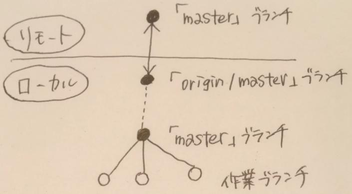

# Git command

[トップに戻る](../index.md)

## 設定

```shell
git config --global user.name "<user_name>"
git config --global user.email <mail_address>
git config --global core.editor vim
git config --global diff.tool vimdiff
git config --global difftool.prompt false
git config --global merge.tool vimdiff
git config --global mergetool.prompt false
git config --global credential.helper store
```

## 構文

[言語チートシート](https://github.com/draemonash2/other)参照。

## 用語

- 統合ブランチ
    - リリース版が何時でも作成可能なようしておくためのブランチ。トピックブランチの分岐元。
- トピックブランチ
    - 機能追加やバグ修正といったある課題に関する作業を行うために作成するブランチ
        
- [merge（fast-forward(早送り)）](https://nullnote.com/web/git/merge_rebase/)
    - 新しくマージコミットを作成せずに合流させる
        - 例）masterブランチにissue2をマージ
            - 変更前
                
            - 変更後
                .jpg)
- [merge（non fast-forward）](https://nullnote.com/web/git/merge_rebase/)
    - 新しくマージコミットを作成して合流させる
        - 例）masterブランチにissue3をマージ
            .jpg)
- [rebase](https://nullnote.com/web/git/merge_rebase/)
    - 履歴を一本化させるマージ (★マージ)
        - mergeとrebaseは、チームの運用方針に応じて使い分ける
            - トピックブランチに統合ブランチの最新コードを取り込む場合…rebase
            - 統合ブランチにトピックブランチを取り込む場合…rebase後にmerge
                
- rebase -i
    - コミットの書き換え、入れ替え、削除、統合を行う
        - 例）書き換え
            
        - 例）統合
            
- merge --squash
    - このオプションを指定してブランチをマージすると、そのブランチのコミットすべてをまとめたコミットが追加される
        
- fetch
    - リモートリポジトリの内容を確認したいだけの時（マージしたくないとき）に、履歴だけ取得できる機能
    - 取得したコミットは名前のないブランチ(origin/master)として取り込まれる。
- cherry-pick
    - 別のブランチから指定したコミットをコピーして、現在のブランチに取り込む
        
- rm
    - ファイルをインデックスから削除する
- reset
    - いらなくなったコミットを捨てる
    - 主な利用シーンは以下の通り
        - hard：最近のコミットを完全に無かったことにする
        - mixed：変更したインデックスの状態を元に戻す(デフォルト)
        - soft：コミットだけを無かったことにする
            

    - 変更内容（○：変更する、×：変更しない）

        |モード|HEAD位置|インデックス|作業ツリー|
        |:--:|:--:|:--:|:--:|
        | hard              | ○ | ○ | ○ |
        | mixed(デフォルト) | ○ | ○ | × |
        | soft              | ○ | × | × |

- revert
    - 指定したコミットの内容を打ち消すコミットを作り出す
        
- [origin](https://qiita.com/seri1234/items/e651b3e108a695a92809)
    - origin：デフォルトのリポジトリの場所(URL)の別名
    - master：デフォルトのブランチの名前。メインのブランチ
- 作業ツリー
    - 実際に作業をしているディレクトリのこと
- インデックス
    - リポジトリにコミットする準備をするための場所のこと
        
- 軽量タグ(`git tab <tagname>`)
    - 名前を付けられる
- 注釈付きタグ(`git tab -a <tagname>`)
    - 名前/コメント/署名をつけられる

## Tips

- HEAD~の意味
    - コミットを指定するときに、~(チルダ)と^(キャレット)を使ってあるコミットからの相対位置で指定することもできます。
    - この時に、よく使われるのがHEADです。~(チルダ)を後ろに付け加えることで何世代前の親かを指定することができます。^(キャレット)は、ブランチのマージで親が複数ある場合に、何番目の親かを指定することができます。
        - 1つ前のHEAD位置の指定の仕方
            - 例1）HEAD^
            - 例2）HEAD~
        - 2つ前のHEAD位置の指定の仕方
            - 例1）HEAD^^
            - 例2）HEAD~~
            - 例3）HEAD~2
                
- ハッシュ値(SHA-1)について
    - Git は、最初の数文字をタイプしただけであなたがどのコミットを指定したいのかを汲み取ってくれます。(詳細は[こちら](https://git-scm.com/book/ja/v2/Git-%E3%81%AE%E3%81%95%E3%81%BE%E3%81%96%E3%81%BE%E3%81%AA%E3%83%84%E3%83%BC%E3%83%AB-%E3%83%AA%E3%83%93%E3%82%B8%E3%83%A7%E3%83%B3%E3%81%AE%E9%81%B8%E6%8A%9E))
    - 条件は、SHA-1 の最初の 4 文字以上を入力していることと、それでひとつのコミットが特定できる (現在のリポジトリに、入力した文字ではじまる SHA-1 のコミットがひとつしかない) ことです。
- [「masterブランチ」と「origin/masterブランチ」](https://qiita.com/wann/items/688bc17460a457104d7d)
    - 「master」ブランチ
        - ローカルの中心となる統合ブランチで、他のローカルの作業ブランチと繋がったもの。
    - 「origin/master」ブランチ
        - ローカルにある、リモートのmasterブランチを追跡するリモート追跡ブランチ。
            
- [git diff と git log におけるドット表記](https://zenn.dev/yoichi/articles/git-dotted-notations)
- [自環境でのみgitignoreする](https://aruo.net/arbk/blog/article/Tips_FAQ_Git%E3%81%A7%E8%87%AA%E5%88%86%E3%81%AE%E7%92%B0%E5%A2%83%E3%81%A0%E3%81%91gitignore_LocalFile%E3%82%92%E5%80%8B%E4%BA%BA%E7%9A%84%E3%81%ABVersion%E7%AE%A1%E7%90%86%E5%AF%BE%E8%B1%A1%E5%A4%96%E3%81%AB%E3%81%99%E3%82%8B%E6%96%B9%E6%B3%95)
- git log 時に表示される日時は、コミット日時？プッシュ日時？cherry-pick日時？
    - コミット日時。正確には作成日(author date)。
        - 参考URL：
            - [Git のコミットのタイムスタンプには author date と committer date の 2 種類があるという話](https://vividcode.hatenablog.com/entry/git/author-date-and-committer-date)
            - [Git での Committer と Author の違いは？](https://kz-engineer-scrap.hatenablog.com/entry/2016/04/05/032916)
- [自分の環境だけgitignoreする方法](https://www.yoheim.net/blog.php?q=20160510)

[トップに戻る](../index.md)
