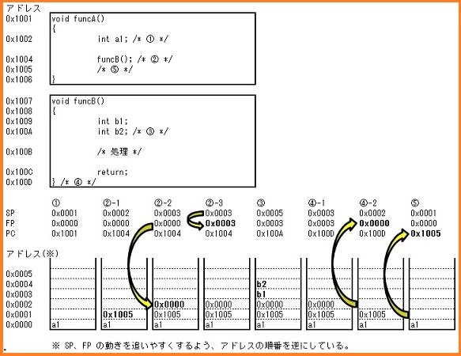
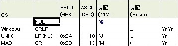

- ロジックアナライザ
	- デジタルデータの解析を行なうためのもの。
	- ロジック（論理）回路が正しく動作しているかを検証するのに使います。
	- 波形を見る事はできません。H/Lの変化が時間軸で分かるに過ぎません。
	- そのかわりたくさんの信号を見ることができます。
	- ロジック・アナライザの電圧分解能は1ビットですので、
	- 被試験信号の波形品質を観察できません。
	- 多信号の解析用
		- ⇒ ロジックの動作解析
- オシロスコープ
	- アナログ信号を表示するためのもの。
	- 波形を観測するためにあります。
	- 波形が正しい形であるかを検証したりするのに使います。
	- 通常は４本程度までしか同時に見る事はできないでしょう。
	- 少数信号の解析用
		- ⇒ボード出来上がり後の波形品質を解析
- 移動平均
	- 一定期間の間隔を定め、その間隔内の平均値を連続して計算することによって趨勢(すうせい)的な動向を知ろうとするもの。
	- 変動の激しい株価や季節的な変動のみられるデパートの売上高の動きなどをみるのに利用される。
-CAN
	-概要
		-CAN2.0A
		-CAN2.0B
	-メディアアクセス方式
		-CSMA/CD (Carrier Sense Multiple Access with Collition Detection)
			-⇒Ethernet と同様
			-⇒リアルタイム性が問われる車載システムで、どう実現されているのか？
	-CAN はアービトレーションを実行することによって、リアルタイムに衝突を検出し、
	-優先ノードの送信をしている！
	-アービトレーションはID: 0 が最も優先度高！
		-⇒優先度を変更するのが困難？
		-Ethernet はフレームに アドレスを含む
		-CAN はフレームにアドレスを含まない
			-⇒送信者、送信先がどこかわからない？
	-高速アクセス
		-伝送長により異なりますが、CANの転送レートは、MAX1Mbpsであり、制御系LANとしては、適度なアクセススピードを実現できます。
	-エラー検出
		-エラー検出として送信2つ受信Textが3つのエラー検出機能があり、充実しています。
	-短いメッセージ構成
		-メッセージとしては、0byte〜8byteと短いメッセージ構成がとなっていますので再送信などの場合、再送までの時間がかなり短くなります。
	-マルチマスター方式
		-データとしては、マルチマスタ方式での通信となります。
	-バスアクセスの優先順位
		-バスの優先順位は、IDの低いものが優先となります。
	-車載が一番に考えられますが、その他にも、CANの特徴を生かした多くのシステムに使用され始めている
	-情報系 10000-100000kbps
	-パワートレイン系 500kbps
	-ボディー系 10-125kbps
	-BasicCAN
		-一般的に送信バッファと受信バッファの数が少なく，マスクレジスタにも制限があり，CPUに負荷がかかります
	-FullCAN
		-送信バッファと受信バッファの数が多く，マスクレジスタにおいても許容範囲が大きいため，CPUへの負荷が少なくて済みます。富士通が対応してい
- AUTOSAR
	- 階層
		- アプリケーション層
		- AUTOSARランタイム環境（Run time Environment：RTE）
		- 基盤ソフトウエア（Basic Software：BSW）
			- サービス層
				-システムサービス，メモリサービス，通信サービスからなり， 大部分がハードウェアから独立している。
			- ECU抽象化層
				- ハードウェアには依存していないがECUには依存している階層であり，主に搭載機器抽象化，メモリハードウェア抽象化，通信ハードウェア抽象化，I/Oハードウェア抽象化からなる。ECU抽象化層の目的は，ECUのすべてのコンポーネントを抽象化することである。
			- マイクロコントローラ抽象化層（MCAL）
			- 複合ドライバ層
				- 主に処理が間に合わない時などに使用します
- FP、SP の違い（https://www.uquest.co.jp/embedded/learning/lecture13.html より引用）
	- フレームポインタ (FP)
		- 現実行関数スタックのベースアドレス
	- スタックポインタ (SP)
		- スタックの先頭アドレス

			
- マルウェア
	- 概要
		- 不正かつ有害な動作を行う意図で作成された悪意のあるソフトウェアや悪質なコードの総称（Malicious（悪意のある）＋ Software）
	- 種類
		- トロイの木馬
			- 一見便利なプログラムと見せかけ、あなたのパソコンに入り込んで混乱や損害を引き起こします。
		- スパイウェア
			- 目的のソフトウェアと一緒に、知らないうちにインストールされてしまうという点で、スパイウェアはトロイの木馬と似ています。
			- ほとんどの場合、スパイウェアはありがたくない存在ですが、調査の手段として、または企業が事業目的を果たすためにスパイウェアを使うこともあります。 
		- バックドア
		- キーロガー
		- マクロウイルス（WordやExcel）
		- ブートセクタウイルス
		- スクリプトウイルス (BAT、Windowsシェル、JavaScriptなど)
		- クライムウェア
		- スケアウェア
		- 悪質なアドウェア
		- ミスリーディングアプリケーション
- 改行コード

	
- テストカバレッジ

|CX|カバレッジ|和名|説明|
|:---|:---|:---|:---|
| C0 | ステートメントカバレッジ | 命令網羅     | 命令全体のうちテストできるものの比率                 |
| C1 | ブランチカバレッジ       | 分岐網羅&br()判定条件網羅     | コード内の分岐のうちテストできるものの比率           |
| C2 | コンディションカバレッジ | 条件網羅率   | コード内に記述された条件のうちテストできるものの比率 |
