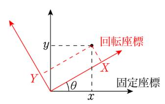

[トップに戻る](../index.md)

# セキュリティ
- マルウェア
	- 概要
		- 不正かつ有害な動作を行う意図で作成された悪意のあるソフトウェアや悪質なコードの総称（Malicious（悪意のある）＋ Software）
	- 種類
		- トロイの木馬
			- 一見便利なプログラムと見せかけ、あなたのパソコンに入り込んで混乱や損害を引き起こします。
		- スパイウェア
			- 目的のソフトウェアと一緒に、知らないうちにインストールされてしまうという点で、スパイウェアはトロイの木馬と似ています。
			- ほとんどの場合、スパイウェアはありがたくない存在ですが、調査の手段として、または企業が事業目的を果たすためにスパイウェアを使うこともあります。 
		- バックドア
		- キーロガー
		- マクロウイルス（WordやExcel）
		- ブートセクタウイルス
		- スクリプトウイルス (BAT、Windowsシェル、JavaScriptなど)
		- クライムウェア
		- スケアウェア
		- 悪質なアドウェア
		- ミスリーディングアプリケーション

# 機材
- ロジックアナライザ
	- デジタルデータの解析を行なうためのもの。
	- ロジック（論理）回路が正しく動作しているかを検証するのに使います。
	- 波形を見る事はできません。H/Lの変化が時間軸で分かるに過ぎません。
	- そのかわりたくさんの信号を見ることができます。
	- ロジック・アナライザの電圧分解能は1ビットですので、
	- 被試験信号の波形品質を観察できません。
	- 多信号の解析用
		- ⇒ ロジックの動作解析
- オシロスコープ
	- アナログ信号を表示するためのもの。
	- 波形を観測するためにあります。
	- 波形が正しい形であるかを検証したりするのに使います。
	- 通常は４本程度までしか同時に見る事はできないでしょう。
	- 少数信号の解析用
		- ⇒ボード出来上がり後の波形品質を解析

# 技術
- CAN
	- 概要
		- CAN2.0A
		- CAN2.0B
	- 特徴
		- 高速アクセス
			- 伝送長により異なりますが、CANの転送レートは、MAX1Mbpsであり、制御系LANとしては、適度なアクセススピードを実現できます。
		- エラー検出
			- エラー検出として送信2つ受信Textが3つのエラー検出機能があり、充実しています。
		- 短いメッセージ構成
			- メッセージとしては、0byte～8byteと短いメッセージ構成がとなっていますので再送信などの場合、再送までの時間がかなり短くなります。
		- マルチマスター方式
			- データとしては、マルチマスタ方式での通信となります。
		- バスアクセスの優先順位
			- バスの優先順位は、IDの低いものが優先となります。
			- アービトレーションを実行することによって、リアルタイムに衝突を検出し、優先ノードの送信をしている！
				- アービトレーションはID: 0 が最も優先度高！
					- ⇒優先度を変更するのが困難？
					- Ethernet はフレームに アドレスを含む
					- CAN はフレームにアドレスを含まない
						- 送信者/送信先はID毎にあらかじめ決められているため、不要！
		- メディアアクセス方式
			- CSMA/CD (Carrier Sense Multiple Access with Collition Detection)
				- ⇒Ethernet と同様
				- ⇒リアルタイム性が問われる車載システムで、どう実現されているのか？
	- 利用業界
		- 車載が一番に考えられますが、その他にも、CANの特徴を生かした多くのシステムに使用され始めている
	- 速度
		- 情報系
			- 10000-100000kbps
		- パワートレイン系
			- 500kbps
		- ボディー系
			- 10-125kbps
	- 種類
		- BasicCAN
			- 一般的に送信バッファと受信バッファの数が少なく，マスクレジスタにも制限があり，CPUに負荷がかかります
		- FullCAN
			- 送信バッファと受信バッファの数が多く，マスクレジスタにおいても許容範囲が大きいため，CPUへの負荷が少なくて済みます。富士通が対応してい
	- 参考URL
		- [CAN基礎@keyence](https://www.keyence.co.jp/ss/products/recorder/lab/candata/)
		- [CAN中級](https://eetimes.jp/ee/spv/0912/15/news104.html)
		- [CAN詳細](https://japan.renesasrulz.com/cfs-file/__key/communityserver-discussions-components-files/83/RJJ05B0937_2D00_0100.pdf)
- AUTOSAR
	- 階層
		- アプリケーション層
		- AUTOSARランタイム環境（Run time Environment：RTE）
		- 基盤ソフトウエア（Basic Software：BSW）
			- サービス層
				-システムサービス，メモリサービス，通信サービスからなり， 大部分がハードウェアから独立している。
			- ECU抽象化層
				- ハードウェアには依存していないがECUには依存している階層であり，主に搭載機器抽象化，メモリハードウェア抽象化，通信ハードウェア抽象化，I/Oハードウェア抽象化からなる。ECU抽象化層の目的は，ECUのすべてのコンポーネントを抽象化することである。
			- マイクロコントローラ抽象化層（MCAL）
			- 複合ドライバ層
				- 主に処理が間に合わない時などに使用します
- レゾルバセンサ
	- 概要
		- モーターの角度と回転速度を検出するセンサー。取得した情報をもとに、モーターを細かく制御する。
	- 構造
		- ステータに2次側巻線として2つのピックアップ巻線を90°に配置。リファレンス信号を加える1次側巻線もステータ上に配置し、ローターには中継用の巻線のみを搭載。（ブラシ構造は持ちません）
	- 検出までの流れ
			1. リファレンス信号を1次側巻線へ加える。
			1. ローターの巻線上に誘導される。
			1. ステータ上の2つの2次側巻線には、ローターの角度に応じて、起電力が発生
	- 参考URL
		> https://www.analog.com/jp/landing-pages/003/sensor_pv_jp/sensor_home_jp/sd_rd/sdrd_structure.html
		> https://ameblo.jp/odamaki3/entry-12373259657.html
		> https://www.minebeamitsumi.com/strengths/column/resolver/index.html
- ベクトル制御
	- 数式
		- クラーク変換
			- Iu + Iv + Iw = 0
			- Iα= Iu
			- Iβ= (Iu + 2Iv) / &radic;3
		- パーク変換
			- Id = ＋Iα・cosθ＋Iβ・sinθ
			- Iq = －Iα・sinθ＋Iβ・cosθ
		- 逆パーク変換
			- Vα= Vd・cosθ－Vq・sinθ
			- Vβ= Vd・sinθ＋Vq・cosθ
	- [固定座標から回転座標へ変換](https://physics-school.com/rotate-coordinates-equation/)
		
	- 参考URL
		- [ベクトルエンジンとベクトル制御](https://toshiba.semicon-storage.com/jp/design-support/e-learning/mcupark/village/vector-1.html)
		- [Clarke-Park 変換](https://jp.mathworks.com/solutions/power-electronics-control/clarke-and-park-transforms.html)
		- [\[教育\] マイコン：モータ駆動用ベクトル制御技術（1/4）](https://www.youtube.com/watch?v=0Yd8qOfiWzQ)
	- 他の用語
		- dq軸
			- d：磁界成分
			- q：トルク成分
- [丸め誤差、情報落ち、桁落ち](https://mathwords.net/marumegosa)
	- 丸め誤差
		- 概要
			- ある桁以降を無視することによって生じる誤差
			- ex) 0.1212121212→0.12
	- 情報落ち
		- 概要
			- 絶対値が大きく異なる数を加減算により小さい方の情報が無視されてしまう現象
				- 桁数が有限であるために元々の数が持っていた情報が計算によって失われること（有効数字は落ちていない）
			- ex1) 1.0000＋0.0001＋0.0001＋0.0001→1.0000
			- ex2) 1.4142＋0.0050361→1.4192~~361~~→1.4192（有効数字5桁を維持するため、361が削られる）
		- 対策
			- 数字が小さい方から順に順々に計算する
			- ex1) 0.0001＋0.0001＋0.0001＋1.0000＝1.0003
	- 桁落ち
		- 概要
			- 近い数を引き算することで有効数字が少なくなる現象
			- ex) 
				1. ルート1001（≒31.63858）－ルート999（≒31.60696）＝0.03162（有効数字7桁→4桁）
				1. コンピュータは有効数字7桁を維持するため、勝手に3桁分を0埋めして「0.3162000×10^-1^」としてしまう
				1. …勝手に0埋めしてるけど、これってホントに0？正確には「0.3162278×10^-1^」だよね？
		- 対策
			- ★
		- 参考URL
			- [桁落ちってなんぞ？](https://technologicaladvance.blog.fc2.com/blog-entry-45.html)
- 有効数字
	- 信用できる桁数
	- ex) 36.52476（有効数字７桁）
	- ex) 0.003162（有効数字４桁）

# 言語
- FP、SP の違い
	- フレームポインタ (FP)
		- 現実行関数スタックのベースアドレス
	- スタックポインタ (SP)
		- スタックの先頭アドレス
	- 参考URL
		> https://www.uquest.co.jp/embedded/learning/lecture13.html
	- [SPFPの動き](SPFPの動き.jpg)

# 開発
- テストカバレッジ
	- 種類
		- C0（ステートメントカバレッジ：命令網羅）
			- 命令全体のうちテストできるものの比率
		- C1（ブランチカバレッジ：分岐網羅/判定条件網羅）
			- コード内の分岐のうちテストできるものの比率
		- C2（コンディションカバレッジ：条件網羅率）
			- コード内に記述された条件のうちテストできるものの比率
		- MCDC (Modified Condition / Decision Coverage)
			- 各ユニット内の条件・判定を網羅した割合。以下の要件を確認する必要がある。
				1．プログラムの全入口／出口を少なくとも1回はテストすること
				1．プログラムの判定に含まれる全条件は可能な値を少なくとも1回はテストすること
				1．プログラムの全判定は可能値を少なくとも1回はテストすること
				1．プログラムの判定の全条件は判定の出力に独立して影響することを示すこと
	- 備考
		- [C2はC1を包含していない](https://www.kzsuzuki.com/entry/codeCoverage1)
			- C2を各条件のtrue / falseを網羅とする方の基準を採用すると、if (A && B)の時に、「A=trueとB=false」と「A=falseとB=true」の組で100%になるが、C1は50%。

# その他
- 移動平均
	- 一定期間の間隔を定め、その間隔内の平均値を連続して計算することによって趨勢(すうせい)的な動向を知ろうとするもの。
	- 変動の激しい株価や季節的な変動のみられるデパートの売上高の動きなどをみるのに利用される。
- 改行コード
	- [改行コード対応表](改行コード対応表.jpg)

[トップに戻る](../index.md)
