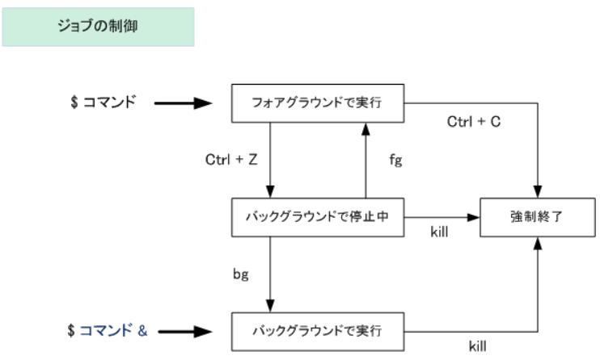

# Linux

[トップに戻る](../index.md)

## 関連リンク

- [WSL2](../wsl2_sft/wsl2.md)
- [Raspberry Pi](../raspberrypi_sft/raspberrypi.md)

## Tips

- コマンドプロンプト記号
    - 【rootユーザー】`#`
    - 【一般ユーザー(Bシェル系)】`$`
    - 【一般ユーザー(Cシェル系)】`%`
    - 【一般ユーザー(Tシェル系)】`>`
- ワイルドカード
    - `?` ：任意の一文字
    - `*` ：0個以上の任意の文字列
- 引用符の違い
    - `'` ：全て文字列としてみなす
    - `"` ：文字列とみなすが、変数の場合は変数の中身を展開
    - ` ：コマンドの場合はコマンド実行結果を展開、変数の場合は変数に格納されたコマンドの実行結果が展開
    - 実験結果：[引用符の違い](#引用符の違い) 参照
- リダイレクト
    - 種別

         | コマンド(*1)                             | 画面(*2)        | ファイル(*2) | 出力形式 |
         | :---                                     | :---            | :---         | :---     |
         | `command > out.log`                      | E               | O            | 新規     |
         | `command 2> out.log`                     | O               | E            | 新規     |
         | `command > out.log 2>&1`                 | -               | O/E          | 新規     |
         | `command &> out.log`                     | -               | O/E          | 新規     |
         | `command &>> out.log`                    | -               | O/E          | 追記     |
         | `command >> out.log 2>&1`                | -               | O/E          | 追記     |
         | `command 1> stdout.log 2> stderr.log`    | -               | O/E(*3)      | 新規     |
         | `command \| tee -a out.log`              | O/？            | O            | 新規     |
         | `command \|& tee -a out.log`             | O/E             | O/E          | 新規     |
         | `command &> /dev/null`                   | -               | -            | -(*4)    |

        - (*1) command を exec とすると、以降の出力先を変更するコマンドになる
        - (*2) O:標準出力、E:標準エラー出力
        - (*3) 標準出力をstdout.logへ、標準エラー出力をstderr.logへ出力
        - (*4) 画面とファイル出力を抑制したい場合に使用する
- フォアグラウンドとバックグラウンドの制御
    
- [「E: Unable to locate package」エラー解消法＠Ubuntu](https://qiita.com/hatorijobs/items/c503840c13672e12d188)
    - `apt update` を実行する
        - `sudo apt-get update`
- コマンドインストール方法
    - `sudo apt install <command>`
- [ホームディレクトリパス変更](https://qiita.com/funacchi/items/c3bb78a546cf2605205d)
    1. `sudo vim /etc/passwd`を実行
        - [/etc/passwdについてはこちら](https://www.server-memo.net/centos-settings/system/passwd_shadow.html)
    1. ユーザ名の行を探し、"/home/xxx"を"変えたいディレクトリ"に変更
- [「.tar.gz」とは](https://wa3.i-3-i.info/word12942.html)
    - 複数ファイルを1つにまとめたファイル（tarファイル）をgzipコマンドで圧縮したファイル
- 起動時にエイリアスを設定したい
    1. 「~/.bashrc」に起動時に設定したいエイリアスを設定しておく
- 共有PCにおける自分用ホームディレクトリ設定＆運用方法
    1. 起動時に実行される「~/.bashrc」に以下のエイリアスを設定しておく
        - `alias endo='export HOME=/home/dir'`
    1. bash起動時に 'endo' を実行する
- 共有PCにおける自分用ホームディレクトリ設定＆運用方法
    1. 起動時に実行される「~/.bashrc」に以下のエイリアスを設定しておく
        - `alias endo='export HOME=/home/dir'`
    1. bash起動時に 'endo' を実行する
- 共有PCにおける自分用vimrc設定＆運用方法
    1. 「共有PCにおける自分用ホームディレクトリ設定＆運用方法」にて設定するホームディレクトリに「.vimrc」を格納する
    1. 「共有PCにおける自分用ホームディレクトリ設定＆運用方法」の手順を実施する
- [Linux操作がうまくなるために](https://qiita.com/chooyan_eng/items/b154d57a8da8911db612)
- [NFSとは](https://baremetal.jp/blog/2018/04/17/541/)
    - Network File Systemの略。
    - ネットワーク上のコンピュータが持つストレージを共有するための仕組み。
    - LinuxをはじめとするUNIX系OSの多くに標準で組み込まれている。
- [SSH基礎](https://iatlex.com/linux/ssh)
- bashの設定ファイル一覧と実行順序

- [「.bash\_profile」と「.bashrc」の違い](https://honmushi.com/2020/03/30/bash-custom/)
    - 相違点
        - .bash\_profile … ログイン時に1回だけ実行
        - .bashrc … シェルを起動する度に実行
    - 備考
        - 一般的な設定は特に理由がなければ.bashrc の方に書けば問題ない。
- [シェル、ターミナル、コンソール、コマンドラインの違い](https://qiita.com/tadsan/items/441dcd910537d3f408e5)
- 共有アカウントにおけるホームディレクトリ変更
    1. 事前準備
        1. 以下を共有アカウントの設定ファイル「~/.bashrc」に追記
            - `alias he='export HOME=/home/draemon_ash3/;cd ~;source ./.bashrc;pwd;'`
        1. 個人アカウントの設定ファイル「/home/<user_name>/.bashrc」に自分の設定を追加する
            - ※「/etc/passwd」のパスは書き換えないようにする！
    1. ログオン直後
        1. コマンド「he」を実行する
- [ファイル種別](https://qiita.com/angel_p_57/items/1faafa275525469788b4)
    - レギュラーファイル -
    - ディレクトリ d
    - シンボリックリンク l
    - ブロックデバイスファイル b
    - キャラクタデバイスファイル c
    - パイプ p
    - ソケット s
- [CentOSをインストールする](https://www.geekfeed.co.jp/geekblog/install_centos8_on_wsl2_for_free)
- [GDBの使い方はこちら](../gdb_sft/gdb.md)
- alias rm='rm -i'は避けた方がいい
    - エイリアスのrm -iが定義されてない環境で事故を起こす危険があるから。やるなら、rmとは違う名前で定義すべき。それなら、未定義の環境では コマンドが無いエラーで済む。
- ブレース展開を用いたバックアップファイルの作成
    - cp file.txt{,.bk}
- [紛らわしいけど重大な違いを引き起こすリダイレクト](https://zariganitosh.hatenablog.jp/entry/20110623/redirect_command)
- [シェル変数と環境変数の違い](https://www.tohoho-web.com/ex/shell.html)
    - シェル変数：そのシェルの中だけで使用できる。自シェル内のみ反映。
    - 環境変数：子プロセスにも引き継がれる。自シェルとサブシェルに適用。
        - exportされた変数は環境変数となる。なので、先にexportしておけば、代入時にexportしなくても、サブシェルへ適用できる。
    - 実験結果：[シェル変数と環境変数のスコープ差異](#シェル変数と環境変数のスコープ差異) 参照
- [Bashタブ補完自作方法](https://blog.cybozu.io/entry/2016/09/26/080000)
- [.とsourceの違い](https://takuya-1st.hatenablog.jp/entry/2017/01/07/111105)
    - `.` : どのシェルでも使える(POSIXで定義されている)
    - `source` : bash でしか使わない
- [shとsourceの違い](https://www.softel.co.jp/blogs/tech/archives/5971)
    - `./test.sh` ：新たな子プロセスを生成して実行する
    - `bash test.sh` ：新たな子プロセスを生成して実行する
    - `source test.sh` ：現在のシェルで実行する
    - 実験結果：[shとsourceの違い](#shとsourceの違い) 参照
- [ジョブとプロセスの違い](https://qiita.com/Takatoshi_Hiki/items/4e89ae3cf51794d8a96f)
    - プロセス…メモリ上で実行状態にあるプログラム
    - ジョブ…シェルから見たときの処理の単位をジョブと呼ぶ(プロセスはカーネルから見たときの処理の単位)。シェルのコマンドラインに入力した１行が１つのジョブになる。
- 引数受け取り時の作法
    - 引数を受け取る際は、"$?" "$@" "$1"の様に "..." で囲んだ方が安全です。囲まない場合、引数に\*を含む文字を受け取った場合、カレントフォルダのファイル名に展開されてしまします。
- スクリプトで取得するカレントディレクトリの違い
    - `pwd` ：カレント作業ディレクトリ
    - `$PWD` ：カレント作業ディレクトリ
    - `cd $(dirname ${0}) && pwd` ：スクリプト格納ディレクトリ
- シェル変数と環境変数のスコープ差異
    - シェル変数は自シェル内のみ反映
    - 環境変数は自シェルとサブシェルに適用
    - exportされた変数は環境変数となる。なので、先にexportしておけば、代入時にexportしなくても、サブシェルへ適用できる。
    - 実験結果：[シェル変数と環境変数のスコープ差異](#シェル変数と環境変数のスコープ差異) 参照
- 「シェルスクリプト」と「関数」の引数を組み合わせた場合の動作
    - しっかり各々の引数を引き渡せている！
    - 実験結果：[「シェルスクリプト」と「関数」の引数を組み合わせた場合の動作](#シェルスクリプトと関数の引数を組み合わせた場合の動作) 参照
- シェル変数は関数内で参照できるか？
    - できる！
    - 実験結果：[シェル変数は関数内で参照できるか？](#シェル変数は関数内で参照できるか) 参照
- [シンボリックリンクのパーミッション](https://yohei-a.hatenablog.jp/entry/20110426/1303795350)
    - シンボリックリンクファイルのパーミッションは意味を持たず、指示先のパーミッションが有効となる。
- [bash スクリプトをデバッグする方法](https://qiita.com/aosho235/items/4e913905a130c0eaf86d)
    - 実験結果：[bash スクリプトをデバッグする方法](#bash スクリプトをデバッグする方法) 参照
- シェルスクリプトを実行中に上書きするとシェルスクリプトが再読み込みされ、意図しない挙動をする。
    - sh/bashでのみ発生する。zshは発生しない様子。
    - 参考URLは[こちら](https://moznion.hatenadiary.com/entry/2022/01/02/120903)
- [rmで削除したファイルを復元できる lsof](https://qiita.com/marukome/items/50f90f9a6f5078276e4d)
- シンボリックリンク(フォルダ)配下を辿る方法
    - `git diff/status`
        - ハードリンクを作る
            - git checkout でハードリンクが切れてしまう…
    - `grep`
        - `grep -R`
- [ps コマンドの表示項目](https://beyondjapan.com/blog/2017/08/pscmd/)
    - `pcpu（%cpu）` …プロセスのcpu 使用率
    - `pmem（%mem）` …メモリ使用率
    - `args（cmd,command）` …文字列の引き数がついたコマンド
    - `pid` …プロセスID
    - `ppid` …親プロセスのID
    - `uid（euid）` …実行ユーザのID
    - `gid（egid）` …実行グループのID
    - `user（euser,uname）` …実行ユーザ
    - `group（egroup）` …実行グループ
    - `rss（rssize,rsz）` … 物理メモリ使用量
    - `lstart` …プロセスの起動時刻
- locale とは
    - 規則：言語_国.文字コード
    - [C ロケールとは](https://eng-entrance.com/linux-localization-locale)
        - すべての POSIX 互換システムの?POSIX システムデフォルトロケール
- [各種ツール比較](https://i.loveruby.net/ja/misc/readingcode.html)
    - gonzui
        - 様々な言語に対応しているソースコード検索エンジン。 ファイル内のインクリメンタル検索、ソースブラウズなどが可能。
    - global
        - GNU global。ctagsの強化版？
        - C 言語用。 クロスリファレンス、関数定義元の検索など、高機能。 同梱ツール htags を使うと HTML で出力できる。
        - 不満なところ。グローバル変数と関数ポインタについても定義元を 示してほしい。
        - あと htags で HTML を出力するとき予約語にタグを つけたりできるんだけども、ここでタグを直接出力するのではなく CSS を使って指定できるようにしてほしい。
        - 手元ではそのように 改造して使っている。グローバルに定義されている文字列定数を 書き変えるだけで変更できた。(ただし CSS 名は決め打ち)
        - さらに言えばマクロの中で定義された関数とかローカル変数まで カバーしてくれると完璧なのだが、そこまでやるとほとんど C コンパイラと同じかそれ以上の解析が必要になってしまうので 無理は言わないことにする。
    - cscope
        - 対話形式によるC言語プログラムを検査するツールです。
        - ソースコード全体から、関数や変数の定義場所を検索／移動（タグジャンプ）することや、関数の参照先一覧を表示することができます。
        - 手作業でgrepコマンドを実行するよりも効率的に検索することが可能になります。
        - cscopeのシンボル系検索機能は以下のことが可能です。
            - シンボルの検索（宣言／定義／参照）
            - 定義位置の検索（定義が検索対象
            - 呼び出し先の検索（指定関数から呼び出されている関数の一覧）
            - 呼び出し元の検索（指定関数を呼び出している関数の一覧）
            - 文字列の検索（シンボル検索での検索対象に加えてコメント記述等を対象に検索）
            - egrep での検索（正規表現）
        - C/C++/Java 用。 Curses ベースのソースコードビューア。独自コマンド体系なのが どうも面倒くさい。
        - そういうわけであんまり真面目に使ってないが、機能はかなり豊富だ。 global より cscope のほうが便利という人も多いようである。
    - lxr
        - Linux のソースコード読みを支援するために開発されたツール。 名前は Linux Cross Referencer から来ている。CGI として使うもの。
        - スタンドアロンツールが欲しかったのであまり真面目に使わなかったが、 これはこれでなかなか便利そうだ。
    - cxref
        - C cross referencing & Documentation tool、の名前のとおり クロスリファレンスとドキュメント生成のためのツール。それ用の コメントを付けとかないとドキュメントは生成されない。
        - 基本的には これはドキュメント生成のツールであって、クロスリファレンスは そのオマケみたいなもの。
        - ソース読みが目的なら上記のどれかを使うほうがいい。
    - cflow
        - 昔から UNIX に付いてるツール。 C 言語の関数の呼び出し関係をテキストで表示してくれる。
        - 今となってはメチャクチャ便利というものではないが、 シンプルだし、パイプへの出力に使えるので持ってて損はない。
- [bashのPS1で使える特殊文字](https://www.miracleave.co.jp/contents/226/post-226/?amp=1)
    - プロンプトの色を変更するには `\e[太さ;色番号m`、元に戻すには `\e[m` を、`\[ ... \]` で挟んで指定します。
    - 太さは 0 が通常、1 が太字、色は、黒(30)、赤(31)、緑(32)、黄色(33)、青(34)、マジェンダ(35)、シアン(36)、灰色(37)、白(97) などを指定できます。
        - [色種別一覧](https://qiita.com/fernet/items/4dcb6f82520d87227121)
    - 特殊文字は以下の通り。

        |特殊文字|説明|
        |:---|:---|
        | \a        | ビープ音を鳴らす |
        | \A        | 24時間表記の時分(例:23:59) |
        | \e        | エスケープ文字(ESC) |
        | \d        | 曜日 月 日(例:Sun May 24) |
        | \D{fmt}   | %Y/%m/%d %H:%M:%S などのフォーマットで日時を指定 |
        | \h        | ホスト名(例:msv02) |
        | \H        | ホスト名(例:msv02.example.com) |
        | \j        | バックグランドジョブの個数(例:2) |
        | \l        | ターミナル(例:/dev/pts/2)の最後のファイル名(例:2) |
        | \n        | 改行 |
        | \r        | キャリッジリターン |
        | \s        | シェルの名前(例:bash) |
        | \t        | 24時間表記の時刻(例:23:59:59) |
        | \T        | 12時間表記の時刻(例:11:59:59) |
        | \@        | AM/PM付き12時間表記の時分(例:11:59 PM) |
        | \u        | ユーザー名(例:tanaka) |
        | \v        | bashのバージョン(例:4.2) |
        | \V        | bashのバージョン(例:4.2.46) |
        | \w        | カレントディレクトリ(例:~/bin) |
        | \W        | カレントディレクトリ(例:bin) |
        | \#        | 現在のセッションにおけるヒストリ番号(例:21) |
        | \\!       | ヒストリ番号(例:423) |
        | \\$       | ルート権限の場合は #、一般権限の場合は $ |
        | \nnn      | 8進数での文字コード |
        | \\\\      | バックスラッシュそのもの |
        | \\[       | 非表示文字の開始 |
        | \\]       | 非表示文字の終了 |

- ハードリンク vs シンボリックリンク

    | シチュエーション | ハードリンク | シンボリックリンク |
    | :--- | :--- | :--- |
    | 作り方 | `ln <file> <linkfile>` | `ln -s <file> <linkfile>` |
    | リンク作成可否 to ファイル | 可 | 可 |
    | リンク作成可否 to ディレクトリ | 不可 | 可 |
    | リンク作成可否 to 別パーティション | 不可 | 可 |
    | リンク作成可否 to 別ファイルシステム | 不可 | 可 |
    | アクセス権 | それぞれ別々のアクセス権 | リンク元のアクセス権 |
    | 実ファイル削除時のリンクアクセス可否 | 可 | 不可 |
    | リンクファイル削除時の実ファイル残否 | 残る | 残る |
    | 実ファイル削除時のリンクファイル残否 | 残る | 残る |
    | ls時に表示されるファイル種別 | - | l |
    | リンク上書き時の挙動＠cp（ `cp <file> <linkfile>` ） | 実ファイルが更新される | 実ファイルが更新される |
    | リンク上書き時の挙動＠mv（ `mv <file> <linkfile>` ） | リンクファイルが上書きされる（リンクファイルがなくなる） | リンクファイルが上書きされる（リンクファイルがなくなる） |
    | リンクコピー時の挙動＠cp（ `cp <linkfile> <file>` ） | 実ファイルが複製される | 実ファイルが複製される |
    | リンク移動/リネーム時の挙動＠mv（ `mv <linkfile> <file>` ） | リンクファイルが移動/リネームされる | リンクファイルが移動/リネームされる |
    | リンクを辿るか（ディレクトリ＠git status） | - | 辿らない |
    | リンクを辿るか（ディレクトリ比較＠git diff） | - | 辿らない |
    | リンクを辿るか（ディレクトリ比較＠diff -r） | - | 辿る |
    | リンクを辿るか（ディレクトリ比較＠diff -r --no-dereference） | - | 辿らない |
    | リンクを辿るか（ファイル＠git status） | 辿る | 辿らない |
    | リンクを辿るか（ファイル比較＠git diff） | 辿る | 辿らない |
    | リンクを辿るか（ファイル比較＠diff） | 辿る | 辿る |
    | リンクを辿るか（ファイル比較＠diff --no-dereference） | 辿る | 辿らない |

- [コマンド実行時に環境変数を指定する](https://ageage0830.hatenablog.com/entry/2018/04/16/135854)

    <details>
    <summary>実行例</summary>

    ```shell
    $ cat puts_env.sh
    #!/bin/bash
    echo $TESTENV01
    echo $TESTENV02

    $ export TESTENV02=parents02

    $ export TESTENV01=parents01

    $ ./puts_env.sh
    parents01
    parents02

    $ TESTENV01=aaa ./puts_env.sh
    aaa
    parents02

    $ TESTENV02=bbbb ./puts_env.sh
    parents01
    bbbb

    $ TESTENV01=ccc TESTENV02=dddd ./puts_env.sh
    ccc
    dddd
    ```

    </details>

## ショートカットキー

|Ctrl|Shift|Alt|Key|機能|
|:---|:---|:---|:---|:---|
||||Tab|コマンド/ファイル名補完|
|Ctrl|||p/n|コマンド履歴呼出し(1つ前/1つ先)|
|Ctrl|||r|コマンド履歴検索|
|Ctrl|||l|画面クリア|
|Ctrl|Shift||f|検索|
|Ctrl|||c|実行中プログラム強制終了|
|Ctrl|||d|終了|
|Ctrl|||f/b|カーソル移動(1個右/左)|
|||Alt|f/b|カーソル移動(単語単位右/左)|
|Ctrl|||a/e|カーソル移動(行頭/行末)|
|Ctrl|||t|文字入替(現在⇔1つ前)|
|Ctrl|||h/d|文字削除(カーソル左/カーソル位置)|
|Ctrl/||/Alt|w|単語削除(カーソル左/右)|
|Ctrl|||u/k|文字削除(カーソル左側/右側全て)|
|Ctrl|||y|貼付け（上記Ctrl + w,Ctrl + kなどで削除した文字列をペーストできる）|
|Ctrl|||m/j/o|ENTERと同じ|
||Shift|Alt|+/-|タブ内分割追加(垂直/水平)|
|Ctrl|Shift||w|タブ内分割削除|
|||Alt|方向キー|タブ内分割移動|
||Shift|Alt|方向キー|タブ内分割サイズ変更|
|||Alt|Enter|全画面モード|
||||F11|全画面モード|
|Ctrl|||s/q|画面更新 停止/再開|
|Ctrl|Shift||↑/↓|画面スクロール 上/下（WSL2のみ？）|
|Ctrl|Shift||t|新規タブ作成|
|Ctrl|Shift||d|タブ複製|
|Ctrl|/Shift||Tab|タブ切替え 順方向/逆方向|
|Ctrl|Shift||p|コマンドパレット表示|
|Ctrl|Shift||Space|ドロップダウンメニュー表示|
|Ctrl|||+/-|フォントサイズ変更(拡大/縮小)|

## 実験結果

### 引用符の違い

- \'：文字列そのまま
- \"：変数展開
- \`：コマンド実行

    <details>
    <summary>実験</summary>

    ```shell
    $ DATE=date
    $ echo '$DATE'
    $DATE
    $ echo "$DATE"
    date
    $ echo `$DATE`
    Fri May 17 04:26:03 PDT 2013
    ```

    </details>

### shとsourceの違い

- ./xxx.sh：サブシェルで実行
- bash xxx.sh：サブシェルで実行
- source xxx.sh：現在シェルで実行

    <details>
    <summary>実験</summary>

    ```shell
    $ cat test1.sh
    echo TESTENV1=$TESTENV1
    echo TESTENV2=$TESTENV2

    $ cat test2.sh
    #!/bin/bash
    echo TESTENV1=$TESTENV1
    echo TESTENV2=$TESTENV2

    $ export TESTENV1=aaa; TESTENV2=bbb

    $ ./test1.sh
    TESTENV1=aaa
    TESTENV2=

    $ bash test1.sh
    TESTENV1=aaa
    TESTENV2=

    $ source test1.sh
    TESTENV1=aaa
    TESTENV2=bbb

    $ ./test2.sh
    TESTENV1=aaa
    TESTENV2=

    $ bash test2.sh
    TESTENV1=aaa
    TESTENV2=

    $ source test2.sh
    TESTENV1=aaa
    TESTENV2=bbb
    ```

    </details>

### シェル変数と環境変数のスコープ差異

- 適用先
    - シェル変数
        - サブシェルへコピーされない。
            - →親シェルのみで使える。
    - 環境変数
        - サブシェルへコピーされる。
            - →親シェル＋サブシェルで使える。
            - →サブシェルで更新しても親シェルには反映されない。

    <details>
    <summary>実験</summary>

    ```shell
    $ cat main.sh
    #!/bin/sh
    echo = called main.sh
    echo = set variables at main.sh
    ENV1=1
    export ENV2=1
    ./sub.sh
    echo = $ENV1 : $ENV2 : $ENV3 : $ENV4
    echo = finished main.sh

    $ cat sub.sh
    #!/bin/sh
    echo == called sub.sh
    echo == $ENV1 : $ENV2 : $ENV3 : $ENV4
    echo == set variables at sub.sh
    export ENV1=2
    export ENV2=2
    ENV3=2
    export ENV4=2
    echo == $ENV1 : $ENV2 : $ENV3 : $ENV4
    echo == finished sub.sh

    $ ./main.sh
    = called main.sh
    = set variables at main.sh
    == called sub.sh ===
    == : 1 : :
    == set variables at sub.sh ===
    == 2 : 2 : 2 : 2
    == finished sub.sh ===
    = 1 : 1 : :
    = finished main.sh ===
    ```

    </details>

### 「シェルスクリプト」と「関数」の引数を組み合わせた場合の動作

- それぞれ正しく受け渡しできる。

    <details>
    <summary>実験</summary>

    ```shell
    $ cat test3.sh
    #!/bin/bash

    echo arg num:$# , arg:$0 $1 $2 $3

    function testfunc() {
        echo arg num:$# , arg:$0 $1 $2 $3
    }

    echo 'call "testfunc a1 a2"'
    testfunc a1 a2
    echo 'call "testfunc $2 $1"'
    testfunc $2 $1

    echo arg num:$# , arg:$0 $1 $2 $3

    $ ./test3.sh a b c
    arg num:3 , arg:./test3.sh a b c
    call "testfunc a1 a2"
    arg num:2 , arg:./test3.sh a1 a2
    call "testfunc $2 $1"
    arg num:2 , arg:./test3.sh b a
    arg num:3 , arg:./test3.sh a b c
    ```

    </details>

### シェル変数は関数内で参照できるか？

- できる。

    <details>
    <summary>実験</summary>

    ```shell
    $ ./test4.sh
    SHELLENV :aaa
    SHELLENV :aaa
    SHELLENV :aaa

    $ cat test4.sh
    #!/bin/bash
    SHELLENV=aaa
    echo SHELLENV :$SHELLENV
    function testfunc() {
        echo SHELLENV :$SHELLENV
    }
    testfunc
    echo SHELLENV :$SHELLENV
    ```

    </details>

### bash スクリプトをデバッグする方法

```shell
#!/bin/bash

exec 5> debug_output.txt
BASH_XTRACEFD="5"
PS4='$LINENO: '
set -x
```

[トップに戻る](../index.md)
