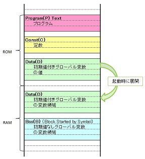
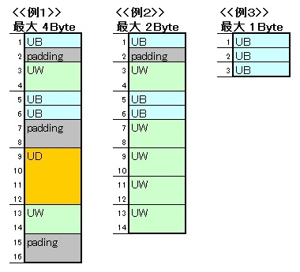

# 構文
- 【if】if ( 条件式 ) { ～ } else if ( 条件式 ) { ～ } else { ～ }
- 【switch】
- 【while】
- 【do while】
- 【関数定義】
- 【変数定義】
- 【typedef】
- 【for】

- 【define】#define ★ (●)
- 【include（標準）】 #include <stdio.h>
- 【include（ユーザ定義）】 #include "dummy.h"
- 【if】#if 条件式 ～ #elseif 条件式 ～ #else ～ #endif
- 【ifdef】#ifdef 条件式 ～ #else ～ #endif
- 【ifndef】#ifdef 条件式 ～ #else ～ #endif

- 【構造体】
- 【共用体】
- 【列挙体】

# Tips
- const
	- const char\* c; /\* Val：変更× Adr：変更○ \*/ → const char のポインタ c を定義
	- char\* const c; /\* Val：変更○ Adr：変更× \*/ → char のポインタ c (const) を定義
- 構造体宣言について
	- 構造体宣言は必ずしも必要とは限らない。AとBは同じ動きをする。
	- 宣言された型を再利用する場合は必要だが、再利用するつもりがないのであれば定義のみでよい。
	- 慣習で宣言する動きのほうがよい場合もあるが…
		- A
			``` c 
			volatile struct {
				tBypassHeader  Header;
				volatile uint8 OutputTable1[CDC_MAXPTRB01];
				volatile uint8 OutputTable2[CDC_MAXPTRB01];
			}cdcBypassB01;
			```
		- B
			``` c 
			typedef struct {
				tBypassHeader  Header;
				volatile uint8 OutputTable1[CDC_MAXPTRB01];
				volatile uint8 OutputTable2[CDC_MAXPTRB01];
			}tcdcBypassB01;
			tcdcBypassB01 cdcBypassB01;
			```
- グローバル変数定義時に初期化子を付加することをしない場合があるのはなぜか？
	- マイコンのような開発では、スタートアップ処理に期待しないようにするため。
（組み込み開発では、初期化子を保持する領域が確保されているとは限らない）
- コンパイルされないことがある。。
	- 差分ビルドでは、コンパイル時CファイルとOBJファイルとのタイムスタンプを比較し、
OBJファイルが新しい場合コンパイルしない仕組みとなっている。
- typedef と define について
	- 単に同義語を作る#defineに比べ、typedef は「型」の同義語を作るという目的が明確である。
		- http://www9.plala.or.jp/sgwr-t/c/sec16.html
	- 相違点
		- define プリプロセッサにより解釈され、typedefはコンパイラにより解釈されます。
		- typedefの場合は、コンパイラが型情報を保持。（単純なソースコード文字列の置換ではない！）
		- （言うならば「変数型に別名でアクセスしている」状態）
		- その為、デバッガで変数を追いかける際にも、typedefの定義は有効です。
		- （ #defineを使った定義では、全く考えられない話）
	- 以下は同義
		``` c 
		#define VAL 0	/* VAL を 0 に置き換える */
		typedef 0 VAL;	/* 0 を VAL として認識させる */
		```
	- しかし、define は以下のようにはできない
		``` c 
		typedef int arrInt[5]							/* int を arrInt[5] として再定義する */
		arrInt a;
		a[0] = 1;
		```
- define の不具合
	``` c 
	#include <stdio.h>
	
	#define char_ptr  char *
	typedef char * char_ptr2;
	
	int main(void)
	{
		char_ptr1 a1, a2, a3;
		char_ptr2 b1, b2, b3;
		
		printf("%d\n", sizeof(a1)); /* ⇒ 4 */
		printf("%d\n", sizeof(a2)); /* ⇒ 1 */
		printf("%d\n", sizeof(a3)); /* ⇒ 1 */
		printf("%d\n", sizeof(b1)); /* ⇒ 4 */
		printf("%d\n", sizeof(b2)); /* ⇒ 4 */
		printf("%d\n", sizeof(b3)); /* ⇒ 4 */
		
		return 0;
	}
	```
- 関数ポインタ例
	```c
	#include <stdio.h>
	
	#define FUNC_EXE_DOINCREMENT    ((int)0x01 << 0)
	#define FUNC_EXE_DODECREMENT    ((int)0x01 << 1)
	#define FUNC_EXE_DODOUBLE       ((int)0x01 << 2)
	#define FUNC_EXE_DOTRIPLE       ((int)0x01 << 3)
	#define FUNC_NUM_MAX            ((int)        4)
	
	void    behavior(int intFuncFlag, int intInputVal, int *intOutputVal);
	int     doIncrement(int arg01);
	int     doDecrement(int arg01);
	int     doDouble(int arg01);
	int     doTriple(int arg01);
	void    debugPrint(int arg01);
	
	int     (*fp[FUNC_NUM_MAX])(int)    =   {
												doIncrement,
												doDecrement,
												doDouble,
												doTriple
											};
	
	int main(void)
	{
		int     intInputVal     = 10;
		int     intOutputVal    = 0;
		
		behavior(
					( FUNC_EXE_DOINCREMENT | FUNC_EXE_DODECREMENT | FUNC_EXE_DODOUBLE | FUNC_EXE_DOTRIPLE),
					intInputVal,
					&intOutputVal
				);
	
		printf("OutputVal is %d !", intOutputVal);
	
		return (0);
	}
	
	void behavior(
					int intFuncFlag,
					int intInputVal,
					int *intOutputVal
				)
	{
		int     intLoopCnt  =   0;
		int     intBitMsk   =   0x01;
		
		debugPrint(intFuncFlag);
		
		for (intLoopCnt = 0; intLoopCnt < FUNC_NUM_MAX; intLoopCnt++) {
			if ((intFuncFlag & intBitMsk) == 1) {
				 *intOutputVal   += fp[intLoopCnt](intInputVal);
			}
			intFuncFlag = intFuncFlag >> 1;
		 }
		 
		 return;
	}
	int doIncrement(int arg01)  { return (arg01 + 1); }
	int doDecrement(int arg01)  { return (arg01 - 1); }
	int doDouble(int arg01)     { return (arg01 * 2); }
	int doTriple(int arg01)     { return (arg01 * 3); }
	
	void debugPrint(int arg01)
	{
		printf("debug print \"%d\"\n", arg01);
		return;
	}
	```
- 組込み用語
	- リセットベクタ		
		- 電源投入時やリセットされた時等に、真っ先に強制的に実行されるアセンブラーレベルでのプログラム実行開始アドレスです。	
	- スタートアップルーチン		
		- データセクションをRAMにコピー
		- BSSセクションの情報を基にRAM上に変数を展開
		- スタックセクションの情報からスタック領域を確保し、スタックの先頭アドレスをMPUのスタックポインタに設定します。	
	- セクション
		- テキストセクション	
			- 命令、関数などの処理を記述しており、実行時に変更されない部分を格納する。RAMにコピーされずにROMに残る
		- データセクション	
			- 初期値付き変数等を格納する。実行時に変更されるため、RAMにコピーされる
		- BSS（Block Started by Symbol）セクション	
			- 初期値無し変数等の情報（変数のサイズとアドレスなど）を格納する。この情報を基にRAM上に変数が配置される
		- スタックセクション	
			- スタックに関してサイズなどの情報を格納する。この情報を基にRAM上にスタックが確保される

- アラインメント
	- 構造体のサイズについて
		- 構造体のサイズは、最大の長さを持つ要素の整数倍に等しくしなければならない（以下の例参照）
			- 引用元：http://www.ertl.jp/~takayuki/readings/info/no01.html

- OS について
	- インバージョン
		- ★
	- デッドロック
		- ★
	- プライオリティーシーリング
		- ★
