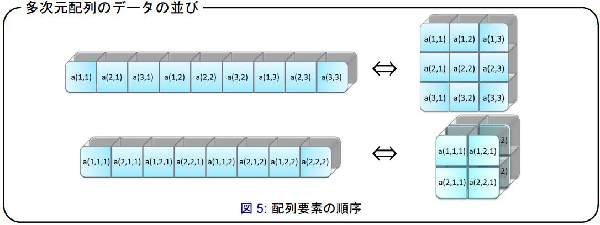

[トップに戻る](../index.md)

# 構文

- 参考URL：[Fortran90](https://www.rs.kagu.tus.ac.jp/yama/f90/f90-lang.html)
- 参考URL：[Fortran90を用いたプログラミングの記述方法＠JAMSTEC](https://www.jamstec.go.jp/es/jp/simschool/f90learning/index.html)

- 【変数定義】REAL :: A,B,C,X
	- データ型
		- 【整数型】INTEGER
		- 【実数型】REAL
		- 【文字型】CHARACTER (LEN=10)
		- 【倍精度実数型】DOUBLE PRECISION
		- 【複素数型】COMPLEX
		- 【論理型】LOGICAL ! 「a=.TRUE.」のように使える
- 【変数定義(配列)】REAL, DIMENSION(10) :: a !要素番号は1オリジン
- 【定数定義】REAL, PARAMETER :: one = 1.0
- 【変数参照(配列)】a(1)
- 【コメント】!
- 【主プログラム定義】PROGRAM プログラム名 ～(各種命令文)～ END PROGRAM プログラム名
- 【副プログラム定義】SUBROUTINE プログラム名(引数の並び) ～(各種命令文)～ END SUBROUTINE プログラム名
- 【関数定義】FUNCTION 関数名(引数の並び) RESULT(結果名) ～(各種命令文)～ END FUNCTION 関数名
- 【モジュール定義】MODULE モジュール名 ～(宣言部)(副プログラム)～ END MODULE モジュール名

- 【算術演算子(べき乗)】A\*\*B
- 【暗黙の型宣言無効化】IMPLICIT NONE
- 【入力】READ (\*,\*) A,B,C !入力文
- 【出力】WRITE(\*,\*) 'X = ' , X
- 【プログラム中止】STOP #C言語でいうRETURNみたいなもの？★
- 【IF】IF (条件式A) THEN ～(条件式A＝真)～ ELSE IF (条件式B) THEN ～(条件式B＝真)～ ELSE ～(条件式B＝偽)～ END IF
- 【DO】DO I=5,10 ～処理～ END DO
- 【論理演算子(AND)】90.0 <= SCORE(I) .AND. SCORE(I) <= 100.0
- 【論理演算子(OR)】90.0 <= SCORE(I) .OR. SCORE(I) <= 100.0
- 【論理演算子(NOT)】.NOT. (90.0 <= SCORE(I))
- 【比較演算子(＜)】<
- 【比較演算子(≦)】<=
- 【比較演算子(＝)】=
- 【比較演算子(≧)】>=
- 【比較演算子(＞)】>
- 【比較演算子(≠)】/=

- 【】USE
- 【】INTERFACE
- 【副プログラムを含む】CONTAINS
- 【配列代入文】
　　WHERE （論理配列式）
　　　　配列代入文1
　　ELSEWHERE
　　　　配列代入文2
　　END WHERE
- 【】
- 【副プログラムに渡す引数の特性(入力,出力,入出力)設定】SUBROUTINE sub(x,y,z) ～ INTEGER,INTENT(IN) :: x ～ INTEGER,INTENT(OUT) :: y ～ INTEGER,INTENT(INOUT) :: z
- 【ポインタ定義(参照元)】INTEGER,POINTER :: x
- 【ポインタ定義(参照先)】INTEGER,TARGET :: y
- 【ポインタ代入】x => y
- 【構造体】★
　　TYPE 構造型名
　　　　型宣言
　　　　　：
　　END TYPE 構造型名
- 【】INTEGER,PRIVATE :: a=10
- 【】
- 【】
- 【】
- 【】
- 【】
- 【】
- 【】
- 【】
- 【】
- 【】
- 【】
- 【】

# Tips
- コンパイル方法
	- gfortran -o 出力ファイル名 ソースファイル名
- SUBROUTINE、FUNCTION、MODULE  違い
	- SUBRUTINE：VBAでいうSubみたいなもの
	- FUNCTION：VBAでいうFunctionみたいなもの
	- MODULE：構造体(クラス)みたいなもの
- 多次元配列におけるメモリの並び順
	- C言語とは次元がことなる。C言語ではa\[0]\[0]の隣のメモリはa\[0]\[1]だが、Fortranではa(0,0)の隣のメモリはa(1,0)

[トップに戻る](../index.md)
