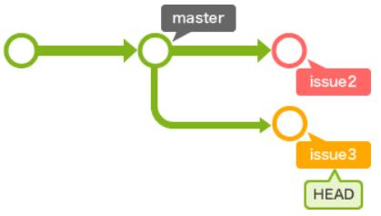
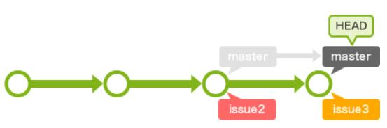
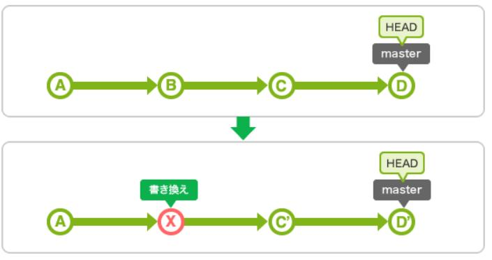
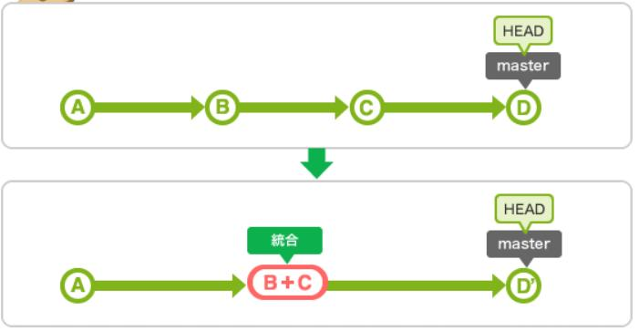
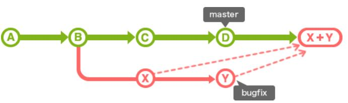
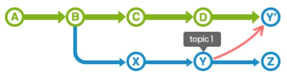
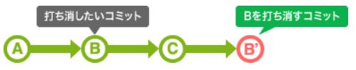
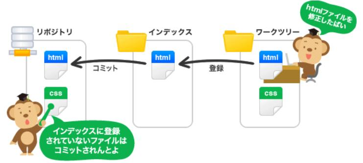
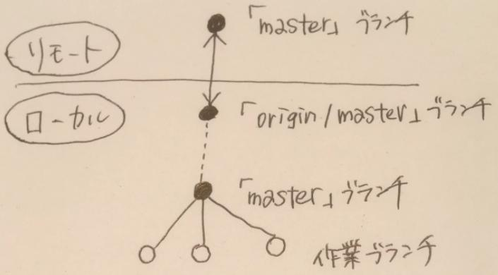

[トップに戻る](../index.md)

# 構文

- 【ログ表示】git log
- 【ログ表示(2件のみ)】git log -2
- 【ログ表示(1行表示)】git log --oneline
- 【ログ表示(グラフ表示)】git log --graph
- 【ディレクトリ作成】git init
- 【変更状態確認】git status

- 【クローン】git clone https://github.com/draemonash2/codes.git codes
- 【プッシュ】git push
- 【プル】git pull
- 【[フェッチ(取得)](#fetch)】git fecth #→リモートの「master」ブランチ → ローカルの「origin/master」ブランチ
- 【フェッチ後のマージ】git merge #→ローカルの「origin/master」ブランチ → ローカルの「master」ブランチ

- 【リモートリポジトリ作成】git remote add origin URL
- 【リモートリポジトリ紐づけ確認】git remote #→originになっていれば完了
- 【リモートリポジトリ紐づけ削除】git rm origin
- 【リモートリポジトリURL表示】git remote -v
- 【初回プッシュ】git push --set-upstream origin master #→ローカルブランチリモート反映
- 【初回プル】git pull origin ブランチ名 #→リモートリポジトリブランチローカル反映

- 【ブランチ作成】git checkout -b ブランチ名
- 【ブランチ切替】git checkout ブランチ名
- 【ブランチ一覧表示(ローカル)】git branch
- 【ブランチ一覧表示(リモート)】git branch -r
- 【ブランチ削除】git branch -d ブランチ名

- 【コミット(追加)】git commit -m “命令形メッセージ”
- 【コミット(上書き)】git commit --amend #→英単語amend＝修正する
- 【コミット(内容追加)】git commit --amend --no-edit #→前回のコミットメッセージのまま
- 【コミット(コメント修正)】git commit --amend -m "修正されたコミット"

- 【インデックス追加(ファイル)】git add ファイル名
- 【インデックス追加(全て)】git add -A
- 【インデックス削除(ファイル)】git rm ファイル名
- 【インデックスリネーム】git mv 旧ファイル名 新ファイル名
- 【作業ツリー巻戻し】git checkout ハッシュ値
- 【作業ツリー巻戻し(ファイル)】git checkout ファイル名
- 【追跡対象外ファイル削除】git clean -fdx
	- -f:強制実行、-d:ディレクトリを削除、-x:.gitignore等で指定されているファイルを除外せず削除

- [変更取消し](https://www-creators.com/archives/1290)
	- 【変更取消し 作業ツリーのみ】git checkout ファイル名
	- 【変更取消し 作業ツリー＋インデックス】git reset HEAD ファイル名
	- 【変更取消し コミット後1】git revert HEAD #→変更を打ち消すコミットを作成
	- 【変更取消し コミット後2】git reset HEAD #→直前のコミットを消去する
	- 【変更取消し コミット後2】git reset HEAD #→直前のコミットを消去する
	- 【変更取消し プッシュ後1】git reset --hard ハッシュ値
	- 【変更取消し プッシュ後2】git reset --hard HEAD^ #→直前コミット消去
	- 【直前reset取消し】git reset --hard ORIG\_HEAD
	- 【全変更取消し インデックス変更後】git checkout -f
	- 【ファイル変更削除】git checkout -- ファイル名
	- [★](https://www-creators.com/archives/1290)

- 変更差分表示
	- (凡例) Work:作業ツリー、Idx:インデックス、Lcl:ローカルリポジトリ、Rmt:リモートリポジトリ
	- 【変更差分表示 Work⇔Idx間】git diff
	- 【変更差分表示 Work⇔Idx間(ファイル名)】git diff -- ファイルパスA
	- 【変更差分表示 Work⇔Lcl(HEAD)間】git diff HEAD
	- 【変更差分表示 Idx⇔Lcl(HEAD)間】git diff --cached
	- 【変更差分表示 Lcl⇔Rmt間】git diff HEAD..リモート名/ブランチ名
	- 【変更差分表示 Rmt Rev間】git log -p ファイル名

- マージ
	- 【マージ(Non Fast-Forward)】git merge [--no-ff] ブランチ名 #→ 今のブランチに選択したブランチをマージ
	- 【マージ(Fast-Forward)】git merge --ff ブランチ名
	- 【マージ取消し】git revert -m 1 ハッシュ値
	- 【リベース】git rebase master #→最新のマスターをブランチに反映させるために使う
	- 【リベース中断】git rebase --abort
	- 【コミット編集】git rebase -i #→入力後、エディタが立ち上がり、以下のコマンドでコミットを編集する
		- pick：コミットをそのまま使う。内容を変更しない。
		- reword：コミットメッセージを変更する。コミット内容は変更しない。
		- edit：コミットを修正する。
		- squash：ひとつ前のコミットにまとめる。コミットメッセージを書き直す。
		- fixup：ひとつ前のコミットにまとめる。コミットメッセージをそのまま使う。
		- exec：shell でコマンドを実行する
	- 【[特定コミット取込み(コミットする)](#cherry-pick)】git cherry-pick ハッシュ値
	- 【特定コミット取込み(コミットしない)】git cherry-pick -n ハッシュ値
	- 【特定コミット取込み(リビジョン範囲指定)】git cherry-pick 古いハッシュ値..新しいハッシュ値

- スタッシュ
	- スタッシュ＝変更差分を一時的に退避する
	- 【スタッシュ 保存1】git stash #→untracked fileを含めない
	- 【スタッシュ 保存2】git stash -u #→untracked fileも含める
	- 【スタッシュ 保存(メッセージ付き)】git stash save "message" #→現在の作業を一時的に退避する
	- 【スタッシュ 復元1】git stash pop #→退避した作業を復元する(スタッシュ削除)
	- 【スタッシュ 復元2】git stash apply #→退避した作業を復元する(スタッシュ保持)
	- 【スタッシュ 一覧表示】git stash list
	- 【スタッシュ 削除(最新分)】git stash drop
	- 【スタッシュ 削除(番号指定)】git stash drop stash@{1}
	- 【スタッシュ 全削除】git stash clear

- 【github上から指定ファイル完全消去】 `find . -name .ファイル前 -print0 | xargs -0 git rm`
	- github上でrevertした場合は必ずプルリクエストまで出す

- 【[問題箇所特定](https://qiita.com/usamik26/items/cce867b3b139ea5568a6)】git bisect
	1. good/badリビジョン指定
		- git bisect start <bad-commit> <good-commit>
	1. テストスクリプトの指定
		- git bisect run テストスクリプトのファイル名

- 【最新コミットハッシュ値取得】git rev-parse HEAD
- 【直近タグバージョン番号表示】git describe

# 用語
## 統合ブランチ
	- リリース版が何時でも作成可能なようしておくためのブランチ。トピックブランチの分岐元。
## トピックブランチ
	- 機能追加やバグ修正といったある課題に関する作業を行うために作成するブランチ
		
## merge（fast-forward(早送り)）
	- [参考URL](https://nullnote.com/web/git/merge_rebase/)
	- 新しくマージコミットを作成せずに合流させる
		- 例）masterブランチにissue2をマージ
			- 変更前
				
			- 変更後
				.jpg)
## merge（non fast-forward）
	- [参考URL](https://nullnote.com/web/git/merge_rebase/)
	- 新しくマージコミットを作成して合流させる
		- 例）masterブランチにissue3をマージ
			.jpg)
## rebase
	- [参考URL](https://nullnote.com/web/git/merge_rebase/)
	- 履歴を一本化させるマージ (★マージ)
		- mergeとrebaseは、チームの運用方針に応じて使い分ける
			- トピックブランチに統合ブランチの最新コードを取り込む場合…rebase
			- 統合ブランチにトピックブランチを取り込む場合…rebase後にmerge
				
## rebase -i
	- コミットの書き換え、入れ替え、削除、統合を行う
		- 例）書き換え
			
		- 例）統合
			
## merge --squash
	- このオプションを指定してブランチをマージすると、そのブランチのコミットすべてをまとめたコミットが追加される
		
## fetch
- リモートリポジトリの内容を確認したいだけの時（マージしたくないとき）に、履歴だけ取得できる機能
- 取得したコミットは名前のないブランチ([origin/master](#「masterブランチ」と「origin/masterブランチ」))として取り込まれる。
## cherry-pick
- 別のブランチから指定したコミットをコピーして、現在のブランチに取り込む
	
## rm
	- ファイルをインデックスから削除する
## reset
	- いらなくなったコミットを捨てる
	- 主な利用シーンは以下の通り
		- hard：最近のコミットを完全に無かったことにする
		- mixed：変更したインデックスの状態を元に戻す(デフォルト)
		- soft：コミットだけを無かったことにする
		
	- 変更内容（○：変更する、×：変更しない）
		
		|モード|HEAD位置|インデックス|作業ツリー|
		|:--:|:--:|:--:|:--:|
		| hard              | ○ | ○ | ○ |
		| mixed(デフォルト) | ○ | ○ | × |
		| soft              | ○ | × | × |
		
## revert
	- 指定したコミットの内容を打ち消すコミットを作り出す
		
## origin
- [originとは？](https://qiita.com/seri1234/items/e651b3e108a695a92809)
	- origin：デフォルトのリポジトリの場所(URL)の別名
	- master：デフォルトのブランチの名前。メインのブランチ
## 作業ツリー
	- 実際に作業をしているディレクトリのこと
## インデックス
	- リポジトリにコミットする準備をするための場所のこと
		
## 軽量タグ(git tab <tagname>)
	- 名前を付けられる
## 注釈付きタグ(git tab -a <tagname>)
	- 名前/コメント/署名をつけられる

# Tips
## HEAD~の意味
- コミットを指定するときに、~(チルダ)と^(キャレット)を使ってあるコミットからの相対位置で指定することもできます。
- この時に、よく使われるのがHEADです。~(チルダ)を後ろに付け加えることで何世代前の親かを指定することができます。^(キャレット)は、ブランチのマージで親が複数ある場合に、何番目の親かを指定することができます。
	- 1つ前のHEAD位置の指定の仕方
		- 例1）HEAD^
		- 例2）HEAD~
	- 2つ前のHEAD位置の指定の仕方
		- 例1）HEAD^^
		- 例2）HEAD~~
		- 例3）HEAD~2
			
## ハッシュ値(SHA-1)について
- Git は、最初の数文字をタイプしただけであなたがどのコミットを指定したいのかを汲み取ってくれます。(詳細は[こちら](https://git-scm.com/book/ja/v2/Git-%E3%81%AE%E3%81%95%E3%81%BE%E3%81%96%E3%81%BE%E3%81%AA%E3%83%84%E3%83%BC%E3%83%AB-%E3%83%AA%E3%83%93%E3%82%B8%E3%83%A7%E3%83%B3%E3%81%AE%E9%81%B8%E6%8A%9E))
- 条件は、SHA-1 の最初の 4 文字以上を入力していることと、それでひとつのコミットが特定できる (現在のリポジトリに、入力した文字ではじまる SHA-1 のコミットがひとつしかない) ことです。
## 「masterブランチ」と「origin/masterブランチ」
- [参考URL](https://qiita.com/wann/items/688bc17460a457104d7d)
	- 「master」ブランチ
		- ローカルの中心となる統合ブランチで、他のローカルの作業ブランチと繋がったもの。
	- 「origin/master」ブランチ
		- ローカルにある、リモートのmasterブランチを追跡するリモート追跡ブランチ。
			
## git diff と git log におけるドット表記
- [参考URL](https://zenn.dev/yoichi/articles/git-dotted-notations)

[トップに戻る](../index.md)
