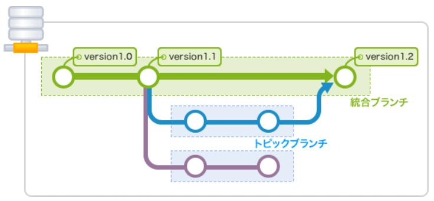

[トップに戻る](../index.md)

# 構文
- 【クローン】git clone https://github.com/draemonash2/codes.git codes

- 【ディレクトリ作成】git init
- 【追加】git add filename.txt
- 【追加(全て)】git add -A
- 【状態確認】git status

- 【リモートリポジトリ作成】git remote add origin URL
- 【リモートリポジトリ紐づけ確認】git remote #→originになっていれば完了
- 【リモートリポジトリ紐づけ削除】git rm origin
- 【ローカルブランチリモート反映(最初のプッシュ)】git push --set-upstream origin master
- 【リモートリポジトリブランチローカル反映(最初のプル)】git pull origin ブランチ名

- 【コミット】git commit -m “命令形メッセージ”
- 【ログ表示】git log
- 【変更取り消し(履歴を残す安全な方法)】git revert ★
- 【変更取り消し(コミット取消＆過去の状態に戻る)】git reset ファイル名
- 【★コミットを指定して戻る】git reset --hard ハッシュ値
- 【★コミットの書き換え、入れ替え、削除、統合】git rebase -i

- 【★コミット内容追加】commit --amend ★
- 【★コミットコメント修正】commit --amend ★

- 【プッシュ】git push
- 【プル】git pull
- 【フェッチ】git fecth

- 【マージ(Non Fast-Forward)】git merge [--no-ff] ブランチ名 #→ 今のブランチに選択したブランチをマージ
- 【マージ(Fast-Forward)】git merge --ff ブランチ名
- 【マージ取り消し】git revert -m 1 ハッシュ地
	★マージ番号とは？

- 【変更を強制的に上書きして元に戻す(マスターブランチで作業してしまった時使用)】git checkout -f
- 【ブランチ作成】git checkout -b ブランチ名
- 【ブランチを変更】git checkout ブランチ名
- 【ファイルの変更を削除】git checkout -- ファイル名
- 【ブランチ削除】git branch -d ブランチ名
- 【ブランチ一覧表示】git branch
- 【スタッシュ(変更データ仮置き)】git stash
- 【ファイル削除】git rm file.txt
- 【★】git stash pop ★
- 【リベース(最新のマスターをブランチに反映させるために使う)】git rebase master
- 【★】git rebase --continue
- 【★】git rebase --abort
- 【★】git cherry-pick

- 【github上から指定ファイル完全消去】 `find . -name .ファイル前 -print0 | xargs -0 git rm`
	- github上でrevertした場合は必ずプルリクエストまで出す

# Tips
# 統合ブランチ vs トピックブランチ
- 統合ブランチ
	- リリース版が何時でも作成可能なようしておくためのブランチ。トピックブランチの分岐元。
- トピックブランチ
	- 機能追加やバグ修正といったある課題に関する作業を行うために作成するブランチ

## マージの種類
- fast-forward(早送り)マージ
	- 新しくマージコミットを作成せずに合流させる
		- 例）masterブランチにissue2をマージ
		.jpg)
	- ★＝rebaseコマンド？
- non fast-forwardマージ
	- 新しくマージコミットを作成してに合流させる
		- 例）masterブランチにissue3をマージ
		.jpg)
	- ★＝mergeコマンド？
- rebase
	- 履歴を一本化させるマージ (★マージ)
		- mergeとrebaseは、チームの運用方針に応じて使い分ける
			- トピックブランチに統合ブランチの最新コードを取り込む場合…rebase
			- 統合ブランチにトピックブランチを取り込む場合…rebase後にmerge
				
- rebase -i
	- コミットの書き換え、入れ替え、削除、統合を行う
		
		
- merge --squash
	- このオプションを指定してブランチをマージすると、そのブランチのコミットすべてをまとめたコミットが追加される
		

## fetch
- リモートリポジトリの内容を確認したいだけの時（マージしたくないとき）に、履歴だけ取得できる機能
- 取得したコミットは名前のないブランチとして取り込まれる。（★何を指定すれば取り込める？）

## タグ
- 軽量タグ(git tab <tagname>)
	- 名前を付けられる
- 注釈付きタグ(git tab -a <tagname>)
	- 名前/コメント/署名をつけられる

## cherry-pick
- 別のブランチから指定したコミットをコピーして、現在のブランチに取り込む
	

## rm vs reset vs revert
- rm
	- ファイルをインデックスから削除する
- reset
	- いらなくなったコミットを捨てる
	- 主な利用シーンは以下の通り
		- mixed：変更したインデックスの状態を元に戻す
		- hard：最近のコミットを完全に無かったことにする
		- soft：コミットだけを無かったことにする
		
		
- revert
	- 指定したコミットの内容を打ち消すコミットを作り出す
		

## HEAD~の意味
- コミットを指定するときに、~(チルダ)と^(キャレット)を使ってあるコミットからの相対位置で指定することもできます。
- この時に、よく使われるのがHEADです。~(チルダ)を後ろに付け加えることで何世代前の親かを指定することができます。^(キャレット)は、ブランチのマージで親が複数ある場合に、何番目の親かを指定することができます。
	

## originとは？
- [originとは？](https://qiita.com/seri1234/items/e651b3e108a695a92809)

[トップに戻る](../index.md)
