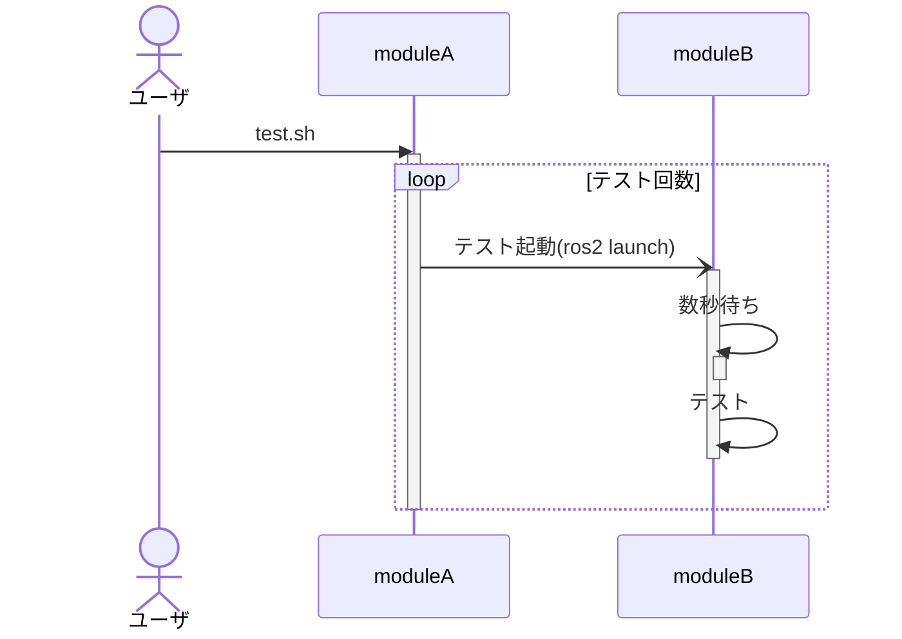

# テスト

[トップに戻る](../index.md)

## 表

|Ctrl|Shift|Alt|Key|機能|
|:---|:---|:---|:---|:---|
|a|b|c|d|ルートに移動|

## テーブル

- aaa

|Ctrl|Shift|Alt|Key|機能|
|:---|:---|:---|:---|:---|
|a|b|c|d|ルートに移動|

- aaa
|Ctrl|Shift|Alt|Key|機能|
|:---|:---|:---|:---|:---|
|a|b|c|d|ルートに移動|
- aaa

|Ctrl|Shift|Alt|Key|機能|
|:---|:---|:---|:---|:---|
|a|b|c|d|ルートに移動|
- aaa
|Ctrl|Shift|Alt|Key|機能|
|:---|:---|:---|:---|:---|
|a|b|c|d|ルートに移動|

- aaa
    - aaa
    
    |Ctrl|Shift|Alt|Key|機能|
    |:---|:---|:---|:---|:---|
    |a|b|c|d|ルートに移動|
    
- aaa
    - aaa
    
        |Ctrl|Shift|Alt|Key|機能|
        |:---|:---|:---|:---|:---|
        |a|b|c|d|ルートに移動|
    
- aaa
    - aaa

        |Ctrl|Shift|Alt|Key|機能|
        |:---|:---|:---|:---|:---|
        |a|b|c|d|ルートに移動|

- aaa
    - aaa
    
|Ctrl|Shift|Alt|Key|機能|
|:---|:---|:---|:---|:---|
|a|b|c|d|ルートに移動|

- aaa --bb
- aaa \-\-bb
- aaa \--bb

## ソース

- 1
```
aaa      bbb
aa       c
```
- 2

```
aaa      bbb
aa       c
```
- 3
```
aaa      bbb
aa       c
```

- 4

```
aaa      bbb
aa       c
```

- 5
    - 5-1
    
    ```
    aaa      bbb
    aa       c
    ```
    
- 6
    - 6-1
        ```
        aaa      bbb
        aa       c
        ```

## コード領域

```txt
イメージ確認                    docker images
公開イメージ検索                docker search <image>
公開イメージ取得                docker pull <image>[:<tag>]
別名イメージ作成                docker tag <old_image> <new_image>[:<new_tag>]
イメージ削除                    docker rmi [opiton] <image1> <image2> ...
イメージ全削除                  docker image prune
イメージ作成（コンテナから）    docker commit <container> <image>
イメージ作成（Dockerfileから）  docker build -t <image>[:<tag>] <dockerfile_dir_path>
イメージ作成（Dockerfileから）  docker build -t <image>[:<tag>] -f <dockerfile_path>
```

## mermaid



[トップに戻る](../index.md)
