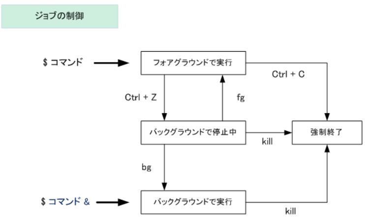
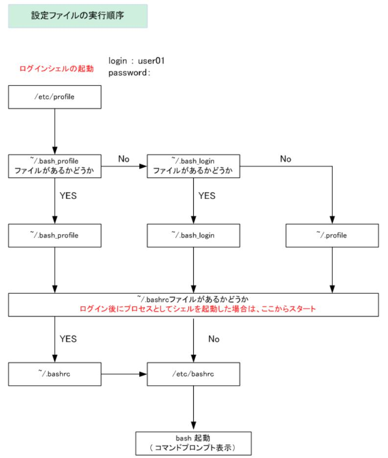

[トップに戻る](../index.md)

# 関連リンク

- [WSL2](https://github.com/draemonash2/wiki/blob/master/sft_wsl2/wsl2.md)
- [Raspberry Pi](https://github.com/draemonash2/wiki/blob/master/sft_raspberrypi/raspberrypi.md)

# コマンド構文

- [コマンド連続実行方法](https://qiita.com/egawa_kun/items/714394609eef6be8e0bf)
	- 【；】コマンド1終了後、コマンド2実行（実行結果に関わらず）
	- 【＆】コマンド1実行(バックグラウンド)中に、コマンド2実行
	- 【｜】コマンド1実行結果をコマンド2へ渡して実行
	- 【＆＆】コマンド1正常終了後、コマンド2実行
	- 【｜｜】コマンド1異常終了時、コマンド2実行
- [シェルスクリプトを実行する時の書いておくとよいこと](https://qiita.com/youcune/items/fcfb4ad3d7c1edf9dc96)
	- 【set -e】エラーがあったらシェルスクリプトをそこで打ち止めにしてくれる
	- 【set -u】未定義の変数を使おうとしたときに打ち止めにしてくれる
- ワイルドカード
	- `?` ：任意の一文字
	- `*` ：0個以上の任意の文字列
- 【まとめてコマンド実行】(cmd1;cmd2)
- 【現在のシェルでコマンド実行】{cmd1;cmd2}
- 引用符の違い
	- 【'】全て文字列としてみなす
	- 【"】文字列とみなすが、変数の場合は変数の中身を展開
	- 【`】コマンドの場合はコマンド実行結果を展開、変数の場合は変数に格納されたコマンドの実行結果が展開
```sh
$ DATE=date
$ echo '$DATE'
$DATE
$ echo "$DATE"
date
$ echo `$DATE`
Fri May 17 04:26:03 PDT 2013
```

- リダイレクト
	- 種別
		- 【>】ファイル出力(ファイル新規作成)
		- 【>>】ファイル出力(ファイル追記)
		- 【<】入力リダイレクト
		- 【<<】入力リダイレクト(終了文字が現れるまで「標準入力」へ送る)
		- 【2>】ファイル出力(エラー出力)
		- 【2>&1】標準出力＆ファイル出力(エラー出力)
	- 備考
		- 標準出力とファイル出力を同時に行いたい場合、「tee」コマンドを使う
- フォアグラウンドとバックグラウンドの制御
	

# シェルスクリプト構文

- 【シェバン(シバン)】#!/bin/bash
	- 「#!」…スクリプトを実行するシェルプログラムを指定する記号
- 【コマンド】#
- 【シェルスクリプト実行方法1】source sample.sh
- 【シェルスクリプト実行方法2】. sample.sh
- 【シェルスクリプト実行方法3】bash sample.sh
- 【シェルスクリプト実行権限付与】chmod +x sample.sh
	- シェルスクリプトをコマンドのように実行したい場合は、実行権限を付与する必要がある。
- 【変数定義】name='Hello World'
- 【変数参照】echo $name
- 【メタキャラクタ】
	- 【data1 と data2】data{1,2}
- 【関数定義】function lsmo() { ls -la | more; }
- 【関数定義削除】unset lsmo
- 【シェルオプション設定】set [-o] [+o] オプション
	- オプション一覧
		- 【作成/変更変数の自動的エクスポート】allexport
		- 【キーバインドemacs化】emacs
		- 【キーバインドvi化】vi
		- 【Ctrl＋Dによるログアウト禁止】ignoreeof
		- 【既存ファイルへの上書き出力禁止】noclobber
		- 【メタキャラクタを使用したファイル名展開無効化】noglob
- 【特殊変数】
	- 【シェルスクリプトファイル名】$0
	- 【引数の数】$#
	- 【引数の値】$n（n=1～9？）
	- 【全ての引数(区切りはスペース)】$@
	- 【全ての引数(区切りは環境変数IFSで指定したもの)】$\*
	- 【現在シェルプロセス番号】$$
	- 【実行コマンド終了ステータス(0=正常終了、1=異常終了、それ以外はエラー）】$?
- 【標準入力取得】echo -n "あなたのお名前は?";read yourname
- 【条件式】
	- 【条件分岐(＝)】test 5 -eq 10; echo $? #→1(偽)
	- 【条件分岐(≠)】test 5 -ne 10; echo $? #→0(真)
	- 【条件分岐(≧)】test 5 -ge 10; echo $? #→1(偽)
	- 【条件分岐(＞)】test 5 -gt 10; echo $? #→1(偽)
	- 【条件分岐(≦)】test 5 -le 10; echo $? #→0(真)
	- 【条件分岐(＜)】test 5 -lt 10; echo $? #→0(真)
	- 【ディレクトリ存在確認】test -d ディレクトリ名
	- 【ファイル存在確認】test -f ファイル名
	- 【文字列空文字列確認】test -n 文字列
	- 【文字列一致確認1】test 文字列1 = 文字列2
	- 【文字列一致確認2】test 文字列1 != 文字列2
	- 【論理結合(否定)】!条件
	- 【論理結合(AND)】条件1 -a 条件2
	- 【論理結合(OR)】条件1 -o 条件2
- 【if】if 条件式 ～ then ～ コマンド(条件式1が真) ～ elif 条件式2 ～ コマンド(条件式2が真) else ～ コマンド(条件式2が偽) ～ fi
- 【for(リスト指定)】for VAR in Level1 Level2 Level3 ～ do ～ echo LinuC $VAR ～ done
- 【for(数値指定)】for NUM in `seq 1 3` ～ do ～ echo LinuC Level $NUM ～ done
- 【while】while read LINE ～ do ～ echo LinuC Level $LINE ～ done < test.txt

# コマンド一覧

- コマンド関連
	- 【コマンド履歴表示】history
	- 【コマンド格納先表示】which passwd
	- 【コマンド格納先表示】whereis ifconfig
	- 【コマンド種別判定】type passwd
	
	- 【標準出力書き出し(改行付与)】echo hello!
	- 【標準出力書き出し(改行なし)】echo -n hello!
	- 【C言語のprintfと同等】printf
	- 【永遠文字列表示】yes
	
	- 【何もしない(戻り値1)】false
	- 【何もしない(戻り値0)】true
	- 【コマンド戻り値判定】test
	- 【式評価】expr
	
	- 【変数中身出力】echo ${var1}
	- 【コマンド実行結果出力】echo $(cmd1)
	- 【直前コマンドの終了ステータス表示】echo $?
	
	- 【出力を複数ファイルやプロセスに渡す】tee
		- コマンド結果をファイルに書きつつ、標準出力にも出力したいときに使う。(リダイレクションでは標準出力されない)
	
	- 【エイリアス設定】alias ll='ls -al'
	- 【エイリアス解除】unalias ll
	
	- 【パッケージインストール(Debian系)】apt install package\_name
		- aptをapt-getの設計改良版の位置づけらしい([詳細はこちら](https://www.atmarkit.co.jp/ait/articles/1708/31/news017.html))
	- 【パッケージ削除(Debian系)】apt remove package\_name
	- 【パッケージ更新(Debian系)】apt upgrade package\_name
	- 【パッケージインストール(RedHat系)】yum install package\_name
	
	- 【コンパイル実行】gcc -o objfile srcfile
	- 【コンパイル実行(コンパイル＆アセンブルのみ)】gcc -c -o objfile srcfile
	
	- 【コマンド結果をクリップボードにコピー】xclip
		- 以下の通りコマンドのインストールが必要。（[詳細はこちら](https://linuxfan.info/xclip)）
			- sudo apt install -y xclip
		- →WSL2では使えないかも…
	
	- 【ユーザ切り替え】su user1
	- 【管理者権限実行】sudo
	
	- 【タイムリミット設定後コマンド実行】timeout 5 cmd
	- 【実行遅延】sleep 1d 1h 1m 1s
	
	- 【コマンドライン引数受取後実行】cmd1 | xargs cmd2
	- 【プロセス実行優先度変更後コマンド実行】nice -n -15 updatedb #実行優先度を「15」低くして、updatedbコマンドを実行
		- niceness…プロセスの優先度を示す値(＝アプリケーション実行順序)(≠スケジュール優先度)
	- 【ログアウト後継続コマンド実行】nohup cmd

- ファイル操作
	- 【ファイルリスト表示】ls
	- 【現在フォルダパス表示】pwd
	- 【非シンボリックリンクパス表示(デフォルト挙動)】pwd -P
	- 【シンボリックリンクパス表示】pwd -L
	- 【ディレクトリ移動】cd
	- 【ディレクトリ移動(直前)】cd -
	
	- 【ファイル作成】touch file
	- 【ディレクトリ作成(再帰的)】mkdir -p aaa/bbb/ccc
	
	- 【ファイル削除】rm a.txt
	- 【ディレクトリ削除(再帰的1)】rm -r aaa
	- 【ディレクトリ削除(再帰的2)】rmdir -p aaa/bbb/ccc
		- 備考1：「rmdir -p aaa」では削除不可
		- 備考2：ディレクトリaaaとbbbとcccのみ削除するため、厳密には配下のファイルをすべて削除するわけではない。
			- →上記より「rm -r aaa」の方がよいと思われる
	
	- 【ファイル移動】mv file.txt bbb/
	- 【ディレクトリ移動】mv ccc ../
		- 再帰的に移動する場合は「mv」コマンドではできない。「cp」と「rm」を使って移動する必要あり。
	
	- 【ファイルコピー1】cp file.txt aaa/file2.txt
	- 【ファイルコピー2】cp file.txt aaa/
	- 【ディレクトリコピー(再帰的)】 cp -r orgdir/ trgtdir/
	- 【ファイルコピー＆変換】dd★
	- 【ファイルコピー(属性指定)】install★
	
	- 【ファイル分割(行番号指定)】split
	- 【ファイル分割(文脈指定)】csplit
	
	- 【ハードリンク作成】ln aaa/trgtfile.txt ./lnkfile
	- 【シンボリックリンク作成】ln -s mydir/trgtfile.txt ./lnkfile
	- 【シンボリックリンクパス表示】readlink ./lnkfile
	- 【リンクファイル削除】unlink ./lnkfile
	
	- 【データを印刷できる形式に変換】base64
	- 【データを印刷できる形式に変換】base32
	- 【データを印刷できる形式に変換】basenc
		- [BASE64とは](https://qiita.com/PlanetMeron/items/2905e2d0aa7fe46a36d4)
			- すべてのデータをアルファベット(a~z, A~z)と数字(0~9)、一部の記号(+,/)の64文字で表すエンコード方式
	
	- 【テキストファイル 折り返し】fmt
	- 【テキストファイル 折り返し(強制)】fold
	- 【テキストファイル ヘッダフッタ付与】pr
	
	- 【タイムスタンプ更新(現在時刻)】touch file
	- 【タイムスタンプ更新(指定時刻)】touch -d "2016-9-20 20:30" file
	
	- 【タブ→空白変換(8文字)】expand -t 8 file
	- 【空白→タブ変換(8文字)】unexpand -t 8 file
	
	- 【ファイルパーミッション変更】chmod 755 \*.sh
		- 755のように数字を3つ並べるのは次の3つを指定している
			- [所有者に対する権限][所有グループに対する権限][その他に対する権限]
		- 数字の意味は次の通り
			- 0: 権限なし
			- 1: 実行権限
			- 2: 書き込み権限
			- 4: 読み込み権限
				- (7=1+2+4で全部OK, 6=2+4で読み書きのみ、といった具合)
		- 755は、"所有者はなんでもできる、他の人は読み書きだけできる"という設定
		- 644は、"所有者は読み書きできる、他の人は読むことだけできる"という設定
	- 【ファイルパーミッション変更】chmod go+w testdata.txt
		- 上記コマンドは、'グループ'と'その他ユーザ'に'書き込み'権限を与えるコマンド
	
	- 【一時的空ファイル/ディレクトリ作成】mktemp
	
	- 【圧縮】tar -czvf xxx.tgz file1 file2 dir1
	- 【展開】tar -xzvf xxx.tgz
	
	- 【ファイルサイズ増減】truncate
		- 10MBの空ファイル作成するとかが可能

- ファイル情報表示
	- 【ファイル中身表示】cat ~/.bash\_history
	- 【ファイル中身表示(反転)】tac ~/.bash\_history
	- 【ファイル中身表示(行番号付)】nl ~/.bash\_history
	- 【ファイル中身表示(バイナリ表示)】od ~/.bash\_history
	
	- 【テキストファイル表示(1画面ずつ)】more
	
	- 【ファイル中身表示(一部先頭)】head -n 5 ~/.bash\_history
	- 【ファイル中身表示(一部末尾)】tail -n 5 ~/.bash\_history
	
	- 【テキストファイル 行数 表示】wc -l file
	- 【テキストファイル 単語数 表示】wc -w file
	- 【テキストファイル バイト数(文字数) 表示】wc -c data
	
	- 【ファイル中身表示(ソート)】sort
	- 【ファイル中身表示(シャッフル)】shuf
	- 【ファイル中身表示(重複削除)】uniq
	- 【ファイル中身表示(前後関係指定ソート)】tsort
	
	- 【ファイル中身表示(垂直抽出)】cut -c 1-5 test.txt #1～5文字目を取出す
	- 【ファイル中身表示(垂直抽出)】cut -d: -f 5 test.txt #区切り文字を「:」として、第5フィールドのみ切り出す
	- 【ファイル中身表示(列結合)】paste -d"," date1.txt date2.txt #「data1.txt」と「data2.txt」を、区切り文字「,」として列結合
	- 【ファイル中身表示(差異比較列結合)】join -j 1 data1.txt data2.txt #「data1.txt」と「data2.txt」の第1フィールドに基づいて列結合
	
	- 【ファイル比較】comm★
	- 【ファイル比較】diff --color file1 file2
	- 【ディレクトリ比較(再帰的)】diff -r dir1 dir2
	- 【ファイル比較(左右並列表示)】sdiff file1 file2
	
	- 【ファイル/ディレクトリ一覧表示】ls
	- 【ファイル/ディレクトリ一覧表示(隠しファイル/詳細情報含む)】ls -al
	- 【ディレクトリ一覧出力】dir
		- ls -C -b と同じ
	- 【ディレクトリ一覧出力】vdir
		- ls -l -b と同じ
	
	- 【ファイル一覧表示(再帰的)】find dirpath -type f
	- 【ディレクトリ一覧表示(再帰的)】find dirpath -type d
	- 【ファイル/ディレクトリ一覧表示(再帰的)】find dirpath
	- 【ファイル/ディレクトリ検索】上記のfindコマンドを用いる
	- 【ファイルツリー出力】tree dirpath
	- 【ファイル種別表示】file filename
	
	- 【リンクファイルパス表示】readlink -f \_lib
	
	- 【ファイル名抽出(拡張子含む)】basename aaa/bbb/test.txt #→test.txt
	- 【ディレクトリパス抽出】dirname aaa/bbb/test.txt #→aaa/bbb
	- 【ファイルパス移植性確認】pathchk aaa/bbb/test.txt
		- 以下の場合にエラーを吐くコマンド
			- パーミッションの関係でディレクトリの中身が見れない
			- ファイル名長すぎ
	- 【相対パス→絶対パス変換】realpath
	
	- 【高速ファイル/ディレクトリ検索】locate "\*.txt"
		- locateコマンドは、事前に「updatedb」コマンドにてインデックスを作成しておく必要あり。
	
	- 【文章から索引作成】ptx★
	
	- 【lsカラー設定】dircolors★
	
	- 【16bitチェックサム＆ブロック数(1024Byte単位) 表示】sum★
	- 【CRCチェックサム 表示】cksum
	- 【BLAKE22ハッシュ値 表示】b2sum★
	- 【128bitチェックサム表示】md5sum
		- →バイナリの一致確認時に使用する
	
	- 【[SHA-1](https://ja.wikipedia.org/wiki/SHA-1)ダイジェスト計算】sha1sum
	- 【SHAダイジェスト計算(xxxビット長)】shaXXXsum
	
	- 【Grep】grep -nr 'const' /mnt/c/codes\_sample/c/FreeRTOSV7.1.1/Source --include='\*.c' >> grep\_result.txt
	
	- 【数値単位変換1】numfmt --from=auto 1Mi #→1048576
	- 【数値単位変換2】numfmt --to=si 500000 #→500K

- 文字操作
	- 【文字列置換(文字単位)】tr
		- 例1）cat data.txt | tr [:lower:] [:uppder:] #data.txtファイルにある小文字全てを大文字に変更
		- 例2）cat data.txt | tr 'a-z' 'A-Z' #data.txtファイルにある小文字全てを大文字に変更 
		- 例3）tr -d : < file1 #data.txtファイルにある「：」を削除して表示
	- 【テキスト処理(文字列置換/抽出/削除等)】sed 's/Wolrd/World/g'
	- 【ソート＆重複削除】cat file1 | sort | uniq
	- 【数字列出力】seq

- システム
	- 【ディスク空き容量表示(DiskFree?)】df -h
	- 【ディレクトリサイズ表示(DiskUsed)】du -h
	- 【メモリ使用状況表示】free
	- 【CPU/メモリ使用状況確認】top
	- 【ファイル作成/更新日時表示】stat file
	- 【実行中ジョブ確認】jobs
	
	- 【プロセス情報表示(全プロセス)】ps -ef
	- 【プロセス情報表示(現在プロセス)】ps $$
	- 【プロセス停止】kill jobno
	- 【メモリにバッファされているデータをディスクに書き込み★】sync
	- 【端末キャラクター表示★】stty
	- 【標準入力ターミナルファイル名表示★】tty
	
	- 【ユーザID表示】id
	- 【現在ログイン名表示】logname
	- 【現在ユーザIDに関連付けされているユーザ名表示】whoami
		- id -un と同等
	- 【所属グループ名表示】groups
	- 【ログオン中ユーザ情報表示】who
	- 【★】pinky
	
	- 【ユーザアカウント作成】useradd -d /home/mike -s /bin/bash mike
		- 「mike」という新規ユーザを作成し、ホームディレクトリ、ログインシェルを指定する設定
	- 【ユーザアカウント変更(グループ変更)】usermod -g sales mike
	- 【ユーザアカウント削除】userdel -r mike
	- 【グループアカウント作成】groupadd sales
	- 【グループアカウント変更】groupmod -n salesmarketing sales
	- 【グループアカウント削除】groupdel sales
	- 【所属グループ表示】id sales
	- 【ログインパスワード変更】passwd mike
	
	- 【環境変数表示】printenv
	- 【環境変数設定(csh系用)】setenv envvar value
	- 【環境変数設定(sh系用)】export envvar='value'
	- 【環境変数変更(一時的)】env
	- 【環境変数表示】env
	
	- 【マウント】mount /dev/sda1 /mnt/hdd1
		- マウント…記憶媒体に対して読み書きを可能にすること
	- 【アンマウント】umount /mnt/hdd1
	- 【マウント状況確認】df -k
	- 【デバイス一覧表示】fdisk -l
	
	- 【時刻(システムクロック)表示】date
	- 【時刻(システムクロック)変更】date 11132330 #→11/13 23:30にセット
	- 【時刻(ハードウェアクロック)変更】hwclock -w #システムクロックの時刻をハードウェアクロックに反映
	
	- 【プロセッサ数表示】nproc
	- 【システム情報表示】uname
	- 【ハードウェア名表示】arch
	- 【ホスト名表示】hostmname
	- 【ホスト識別子表示(16進数)】hostid
	- 【システム起動時間等表示】uptime

- 他
	- 【★】shred
	- 【名前付きパイプ作成★】mkfifo
	- 【特殊ファイル作成★】mknod★
	
	- 【ネットワーク切断】sudo ifconfig wlan0 down
	- 【ネットワーク接続】sudo ifconfig wlan0 up
	- 【ネットワーク状況確認】sudo ifconfig wlan0
	
	- 【マニュアル確認】man wpa\_supplicant.conf
	
	- 【★】awk
		- [sedやgrepのようなテキスト処理ツールに演算機能を持たせた拡張ツール](https://ja.wikipedia.org/wiki/AWK)
	- 【カレンダー表示】cal
	
	- 【コンテンツ取得(fromHTTP)】curl★
	
	- 【TCP/IPアドレス情報表示】ifconfig
	- 【パケット送付】ping 宛先
	- 【★】chcon
	- 【★】runcon
	- 【特定ルートディレクトリでコマンド実行】chroot
	
	- 【★】stdbuf
	- 【素因数分解】factor 60 #→60: 2 2 3 5

# Tips
- [「E: Unable to locate package」エラー解消法＠Ubuntu](https://qiita.com/hatorijobs/items/c503840c13672e12d188)
	- `apt update` を実行する
		- `sudo apt-get update`
- コマンドインストール方法
	- `sudo apt install <command>`
- [ホームディレクトリパス変更](https://qiita.com/funacchi/items/c3bb78a546cf2605205d)
	1. `sudo vim /etc/passwd`を実行
		- [/etc/passwdについてはこちら](https://www.server-memo.net/centos-settings/system/passwd_shadow.html)
	1. ユーザ名の行を探し、"/home/xxx"を"変えたいディレクトリ"に変更
- [「.tar.gz」とは](https://wa3.i-3-i.info/word12942.html)
	- 複数ファイルを1つにまとめたファイル（tarファイル）をgzipコマンドで圧縮したファイル
- VIM設定ファイル格納先
	- ★
- 起動時にエイリアスを設定したい
	1. 「~/.bashrc」に起動時に設定したいエイリアスを設定しておく
- 共有PCにおける自分用ホームディレクトリ設定＆運用方法
	1. 起動時に実行される「~/.bashrc」に以下のエイリアスを設定しておく
		- `alias endo='export HOME=/home/dir'`
	1. bash起動時に 'endo' を実行する
- [Linux操作がうまくなるために](https://qiita.com/chooyan_eng/items/b154d57a8da8911db612)
- [NFSとは](https://baremetal.jp/blog/2018/04/17/541/)
	- Network File Systemの略。
	- ネットワーク上のコンピュータが持つストレージを共有するための仕組み。
	- LinuxをはじめとするUNIX系OSの多くに標準で組み込まれている。
- [SSH基礎](https://iatlex.com/linux/ssh)
- bashの設定ファイル一覧と実行順序

- [シェル、ターミナル、コンソール、コマンドラインの違い](https://qiita.com/tadsan/items/441dcd910537d3f408e5)
- 共有アカウントにおけるホームディレクトリ変更
	1. 事前準備
		1. 以下を共有アカウントの設定ファイル「~/.bashrc」に追記
			- `alias he='export HOME=/home/draemon_ash3/;cd ~;source ./.bashrc;pwd;'`
		1. 個人アカウントの設定ファイル「/home/<user_name>/.bashrc」に自分の設定を追加する
			- ※「/etc/passwd」のパスは書き換えないようにする！
	1. ログオン直後
		1. コマンド「he」を実行する

# ショートカットキー

|Ctrl|Shift|Alt|Key|機能|
|:---|:---|:---|:---|:---|
||||Tab|コマンド/ファイル名補完|
|Ctrl|||p/n|コマンド履歴呼出し(1つ前/1つ先)|
|Ctrl|||r|コマンド履歴検索|
|Ctrl|||l|画面クリア|
|Ctrl|Shift||f|検索|
|Ctrl|||c|実行中プログラム強制終了|
|Ctrl|||d|終了|
|Ctrl|||f/b|カーソル移動(1個右/左)|
|||Alt|f/b|カーソル移動(単語単位右/左)|
|Ctrl|||a/e|カーソル移動(行頭/行末)|
|Ctrl|||h/d|文字削除(カーソル左/カーソル位置)|
|Ctrl|||u/k|文字削除(カーソル左側/右側全て)|
|Ctrl/||/Alt|w|単語削除(カーソル左/右)|
|Ctrl|||t|文字入替(現在⇔1つ前)|
|Ctrl|||y|貼付け（上記Ctrl + w,Ctrl + kなどで削除した文字列をペーストできる）|
|Ctrl|||m/j/o|ENTERと同じ|
||Shift|Alt|+/-|画面分割(垂直/水平)|
|Ctrl|Shift||w|画面分割削除|
|||Alt|方向キー|分割画面移動|
||Shift|Alt|方向キー|分割画面サイズ変更|
|||Alt|Enter|全画面モード|
||||F11|全画面モード|
|Ctrl|||s/q|画面更新 停止/再開|
|Ctrl|Shift||↑/↓|画面スクロール 上/下（WSL2のみ？）|
|Ctrl|Shift||t|新規タブ作成|
|Ctrl|Shift||d|タブ複製|
|Ctrl|/Shift||Tab|タブ切替え 順方向/逆方向|
|Ctrl|Shift||p|コマンドパレット表示|
|Ctrl|Shift||Space|ドロップダウンメニュー表示|
|Ctrl|||+/-|フォントサイズ変更(拡大/縮小)|

[トップに戻る](../index.md)
