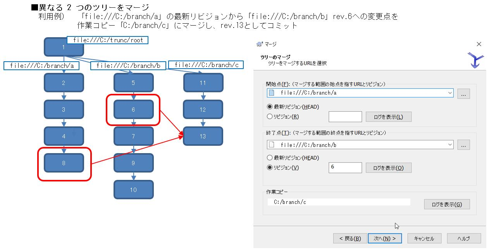

[トップに戻る](../index.md)

# Tips

- プロパティウィンドウに表示されるリビジョンの違い
	- 作業コピーのリビジョン
		- ★
	- 最終変更リビジョン
		- ★
- マージ機能の違い
	- リビジョンの範囲をマージ
		
	
	- 異なる２つのツリーをマージ
		
- リポジトリブラウザ(GUI)をCUIから起動する
	`TortoiseProc.exe /command:repobrowser /path:"https://xxxxx.xx.xx/repos/path/to/"`

[トップに戻る](../index.md)
