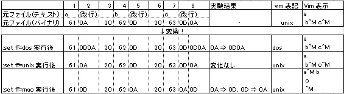
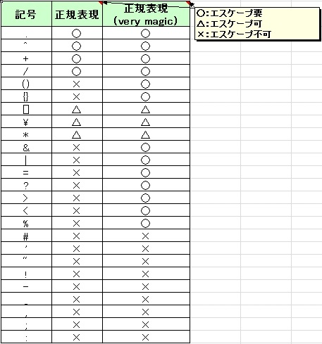
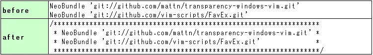
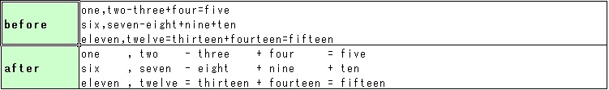
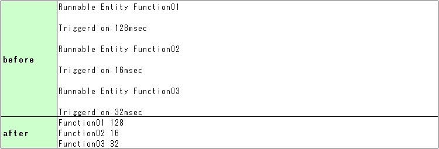

[トップに戻る](../index.md)

# インストール手順

- Vim Kaoriya ダウンロード
- Vim 設定ファイルダウンロード
- Git インストール (コマンドプロンプトにて git clone が実行できる状態にしておく)
- コマンドプロンプトにて、下記コマンドを実行
	- cd ★VIM インストールフォルダ★
	- git clone https://github.com/Shougo/neobundle.vim bundle/neobundle.vim
- vimを起動し、下記コマンドを実行
	-:NeoBundleInstall

# インストール済みプラグイン

| Version | スクリプト |インストール方法 |
|:---|:---|:---|
|7.3.420|VIM kaoriya|本体|
|1.2|desert.vim|plugin への格納のみ|
|1.1|favex.vim|plugin への格納のみ|
|1.4|renamer.vim|plugin への格納のみ|
|4.5|taglist.vim|plugin への格納のみ|
|?|open-browser.vim|plugin への格納のみ|
|11|DrawIt.vba|DrawIt.vba.gz を解凍し、DrawIt.vba を Vim で読み込む。&br()その後、:so % を実行し、インストールを完了する。|
|1.3|bufferlist.vim|plugin へ格納後、下記を\_gvimrcに設定。&br()　map <silent> <F3> :call BufferList()<CR>&br()　※なお、下記設定ファイルを使用する場合は不要&br()　※プラグインの修正が必要。詳細は下記設定ファイル参照(bufferlist\_v20.vim)|
|1.1.8-g|mark.vim|plugin へ格納する。&br()インストール完了後、下記を\_gvimrcに設定(最終行に書く)。&br()　source $HOME/vimfiles/plugin/mark.vim (Windowsの場合の例)&br()　※なお、下記設定ファイルを使用する場合は不要&br()　※プラグインの修正が必要。詳細は下記設定ファイル参照(mark\_v20.vim)|
|36/42|align.vba|align.vba.gz を解凍し、align.vba を Vim で読み込む。&br()その後、:so % を実行し、インストールを完了する。&br()インストール完了後、下記を\_gvimrcに設定。&br()　let g:Align\_xstrlen=3&br()　※なお、下記設定ファイルを使用する場合は不要|
|?|neocomplcache|plugin へ格納する。&br()インストール完了後、下記を\_vimrcに設定。&br() let g:neocomplcache\_enable\_at\_startup = 1 " 起動時に有効化&br()　※なお、下記設定ファイルを使用する場合は不要|
|2|qfixgrep|$VIM/qfixapp に格納する。&br()インストール完了後、下記を\_vimrcに設定。&br()　set runtimepath+=$VIM/qfixapp&br()let mygrepprg   = 'internal'&br()　※なお、下記設定ファイルを使用する場合は不要|
|3|qfixhowm|$VIM/qfixapp に格納する。&br()インストール完了後、下記を\_vimrcに設定。&br()　set runtimepath+=$VIM/qfixapp&br()let QFixHowm\_Key       = 'g' &br()let howm\_dir           = '~/howm' &br()let howm\_filename      = '%Y/%m/%Y-%m-%d-%H%M%S.txt' &br()let howm\_fileencoding  = 'cp932' &br()let howm\_fileformat    = 'dos'&br()　※なお、下記設定ファイルを使用する場合は不要|
|?|Ctags|下記 URL を参考に、インストールする&br()http://nanasi.jp/articles/others/ctags.html &br()※タグファイル作成方法&br()タグファイルを作成したいフォルダに移動し、下記を実行&br()ctags -R|
|?|Gtags|下記 URL を参考に、インストールする&br()http://cha.la.coocan.jp/doc/gnu\_global.html#sec10 &br()（share\gtags\gtags.vim を VIM のスクリプトフォルダに格納する）&br()※タグファイル作成方法&br()タグファイルを作成したいフォルダに移動し、下記を実行&br()gtags -v|
|0.0.5|current-func-info.vim|下記 URL からダウンロード後、VIM のスクリプトフォルダに格納する。&br()http://www.vim.org/scripts/script.php?script\_id=3197 &br()設定ファイルに以下コマンドを記載する。&br()set statusline+=\ [Func:%{cfi#get\_func\_name()}]|

# ショートカットキー

|Ctrl|Shift|Alt|Key|機能|
|:---|:---|:---|:---|:---|
||Shift||[/]|移動 前/次の空行|
||||gv|再度同じ範囲を選択|
||||ge|前単語の末尾へ移動|
||||<C-r> /|最後に検索に使用したワード検索|
||||v ⇒ o |選択範囲の末尾にカーソルを移動|
||||挿入モード⇒<C-r>=0xFFFF|簡易16⇒10進数変換（例では65535）|
||||/\V |テキストで検索|
||Shift||h/m/l|カーソル移動 画面 最上行/中央/最下行|
||||+/-|先頭に移動 次行/前行|
|Ctrl|||f/b|移動 1画面分 上/下|
|Ctrl|||u/d|移動 半画面分 上/下|

# コマンド

| 機能 | コマンド | 説明 |
|:---|:---|:---|
|共通		| :args AAA.txt BBB.txt CCC.txt							| argsコマンドで一度に複数のファイルを開く |
|共通		| :w %<													| 現在開いているバッファ名 (拡張子を除いたもの) 取り出し(:w hoge と同等) |
|共通		| :e #N  (Nは任意の数字)								| #N は、そのN番目のバッファの名前と同じ値になる |
|共通		| q:													| コマンド履歴を表示（ Ctrl+C でカーソル位置のコマンドをコマンドウィンドウに転送） |
|共通		| %!xxd -g 1											| バイナリモードに変更 |
|共通		| :set ic												| 検索・置換時、大文字小文字の区別を有効 |
|共通		| :set noic												| 検索・置換時、大文字小文字の区別を無効 |
|共通		| :set ★?												| 現在の値を表示 ex) set number? |
|共通		| :set ★&												| デフォルト値に戻す ex) set number& |
|共通		| :set ★!												| On/Offのトグル  ex) set number! |
|共通		| :b0, :b1, ...											| バッファ0,1,..に移動 |
|共通		| :buffers												| 編集中のバッファ一覧を表示 |
|共通		| :Sex													| ウインドウを分割してファイルエクスプローラを開く |
|共通		| :ls													| バッファのリストを表示 |
|共通		| :%s/\v\_(.)/\u\1/g									| スネークケース→キャメルケース変換 |
|共通		| %s/\v([A-Z])/\_\L\1/g									| キャメルケース→スネークケース変換 |
|共通		| ;mes													| エラーメッセージがすぐ消える場合、エラー表示させる |
|共通		| コマンド\|コマンド									| コマンド連続実行 |
|共通		| :set encoding=(euc-jp/shift\_jis/utf-8/..)			| テキストファイルの文字コード書換 |
|共通		| :set fileformat=(dos/mac/unix)						| テキストファイルの改行コード書換 |
|共通		| :e ++encoding=(euc-jp/shift\_jis/utf-8/..)			| VIM 上の文字コード表示切替 |
|共通		| :e ++fileformat=(dos/mac/unix)						| VIM 上の改行コード表示切替 |
|共通		| :set fileencoding=(euc-jp/shift\_jis/utf-8/..)		| 現在のファイルの文字コード（ファイル保存時の文字コード）を指定。 |
|共通		| :set fileencodings=(euc-jp/shift\_jis/utf-8/..)		| 自動判別に用いる文字コード（ファイル閲覧時の文字コード）を指定。&br()カンマで区切って優先度の高い順に指定 |
|Grep		| vim {pattern} %\|cw									| vimgrepを実行&br()ex.vimgrep /hogehoge/j c:/test/\*\*/\*.txt\|cw |
|Grep		| bufdo vimgrepa {pattern} %\|cw						| バッファすべてに vimgrep &br()（★貼り付け時は「｜」を半角に★） |
|Grep		| :RGrep 文字列 C:\00\_work\trunk\C\jsp-1.4.4-full\*.c	| 特定のフォルダ配下のCファイルを再帰検索 |
|DrawIt!	| \di（範囲選択後）										| 描画モード開始 |
|DrawIt!	| \ds（範囲選択後）										| 描画モード終了 |
|DrawIt!	| \b （範囲選択後）										| 四角形ボックス描画 |
|DrawIt!	| \e （範囲選択後）										| ひし形ボックス描画 |
|DrawIt!	| v  （範囲選択後）										| v描画 |
|DrawIt!	| ^  （範囲選択後）										| ^描画 |
|DrawIt!	| >  （範囲選択後）										| >描画 |
|DrawIt!	| <  （範囲選択後）										| <描画 |
|surround	| S'													| ビジュアルモードで選択した部分を ' で囲む |
|surround	| yss'													| 行全体を ' で囲む |
|neosnippet	| :NeoSnippetEdit										| スニペットを編集 |

# Tips

- 突然エラーが出るようになった
	- 設定ファイルが小文字になっている！
- 検索/置換について
	- 単語単位検索：/\<the\>
	- ４桁数値検索：/\<\d\d\d\d\>
	- 大/小文字無視（デフォルト）：%s/★/●/i
	- 大/小文字無視しない：%s/★/●/I
	- 置換時のエラーを無視する：%s/★/●/e
	- 全単語の先頭大文字化：%s/\<./\u&/g
	- 全単語の先頭小文字化：%s/\<./\l&/g
	- "/"ではなく"/\v"を使うことで、正規表現時のわずらわしいエスケープを抑制することができる。(very magic指定)
- 検索単語の置換方法
	- 置換したい単語を以下のいずれかの方法で検索
		- 「\*」を使用してカーソル下の単語を検索
		- 「/」による検索
	- コマンドモードに入り, %s//<置換文字列\>/g を実行（検索単語を省略できる）
- global コマンドを用いた置換方法
	- :g/Second/s/Bar/Foo/g
	- ⇒ 末尾に「Second」が含まれる行の「Bar」を「Foo」に変える
		- 【参考】global コマンド の使い方 簡易版
			- g[lobal]/{pattern}/[cmd]
			- ⇒ {pattern}にマッチする行に対して、Exコマンド[cmd](省略した場合 ":p")を実行する。
		- 【置換結果】
			``` c 
			FooBarBazHogeBarFugaPiyoFirst
			FooBarBazHogeBarFugaPiyoSecond
			FooBarBazHogeBarFugaPiyoSecond
			FooBarBazHogeBarFugaPiyoFirst
			FooBarBazHogeBarFugaPiyoSecond
			FooBarBazHogeBarFugaPiyoThird
			FooBarBazHogeBarFugaPiyoSecond
			FooBarBazHogeBarFugaPiyoFirst
			FooBarBazHogeBarFugaPiyoThird
			↓
			FooBarBazHogeBarFugaPiyoFirst
			FooFooBazHogeFooFugaPiyoSecond
			FooFooBazHogeFooFugaPiyoSecond
			FooBarBazHogeBarFugaPiyoFirst
			FooFooBazHogeFooFugaPiyoSecond
			FooBarBazHogeBarFugaPiyoThird
			FooFooBazHogeFooFugaPiyoSecond
			FooBarBazHogeBarFugaPiyoFirst
			FooBarBazHogeBarFugaPiyoThird
			```
- 正規表現( verymagic 指定)

| 手法          | 構文 | 使用例            | 説明                                    |
|:---|:---|:---|:---|
| 肯定先読み	| @=   | kimura( takuya)@= | 後に" takuya"が含まれる"kimura"を検索   |
| 否定先読み	| @!   | kimura( takuya)@! | 後に" takuya"が含まれない"kimura"を検索 |
| 肯定後読み	| @<=  | (inagaki )@<=goro | 前に"inagaki "が含まれる"goro"を検索    |
| 否定後読み	| @<\!  | (inagaki )@<\!goro | 前に"inagaki "が含まれない"goro"を検索  |

- set ff コマンド
	- 「set ff=●」 は "UNIXの改行コード" から "●" の改行コードに変換するもの	
	- 「VIM 下部の"CR/LF=▲"表示」は、ファイルに書かれた改行コードを▲の表示方法で表示するもの ⇒「set ff=●」をしたからといって、「VIM 下部の"CR/LF=▲"表示」が変わる訳ではない！
		
- エスケープ記号要否
	
- 範囲選択後、 \abox を実行
	
- Align コマンド（Align , = + -）
	
- 複数行の置換
	- %s/\vRunnable Entity (\w\*)\n.\*\nTriggerd on (\w\*)msec/\1\t\2/g
		
- 文字数を維持しながら置換するVimコマンド
	- 添付の「文字数を維持しながら置換するVimコマンドを作成する.xlsm」参照
- 【コマンドリダイレクト 開始】:redir > file
- 【コマンドリダイレクト 終了】:redir end
- very magic など
	- "\v" を使うと、それ以降の、'0'-'9'、'a'-'z'、'A'-'Z'、'\_'、以外のすべての ASCII 文字は特別な意味を持ちます。 "very magic"
	- "\V" を使うと、それ以降はバックスラッシュと終端文字 (/ や ?) だけが特別な意味を持ちます。 "very nomagic"

```
+----------------------------+---------+---------+---------+---------+
|                            | very    |         |         | very    |
|                            | magic   | magic   | nomagic | nomagic |
|                            | (\v)    | (\m)    | (\M)    | (\V)    |
+----------------------------+---------+---------+---------+---------+
| 行末                       | $                           | \$      |
+----------------------------+---------+---------+---------+---------+
| 何か 1 文字                | .                 | \.                |
+----------------------------+---------+---------+---------+---------+
| 直前のアトムの繰り返し     | \*                | \\\*              |
+----------------------------+---------+---------+---------+---------+
| 直近の置換文字列           | ~                 | \~                |
+----------------------------+---------+---------+---------+---------+
| グループ化してアトムにする | ()      | \(\)                        |
+----------------------------+---------+---------+---------+---------+
| 選択の区切り               | ｜      | \｜                         |
+----------------------------+---------+---------+---------+---------+
| 英字                       | \a                                    |
+----------------------------+---------+---------+---------+---------+
| リテラルのバックスラッシュ | \\                                    |
+----------------------------+---------+---------+---------+---------+
| リテラルのドット           | \.                | .                 |
+----------------------------+---------+---------+---------+---------+
| リテラルの '{'             | \{      | {                           |
+----------------------------+---------+---------+---------+---------+
| リテラルの 'a'             | a                                     |
+----------------------------+---------+---------+---------+---------+
```

- ウィンドウ１つで起動するオプション
	```
	--remote-tab-silent
	```
- [neosnippet使い方](http://d.hatena.ne.jp/adragoona/touch/20130929/1380437722)

[トップに戻る](../index.md)
