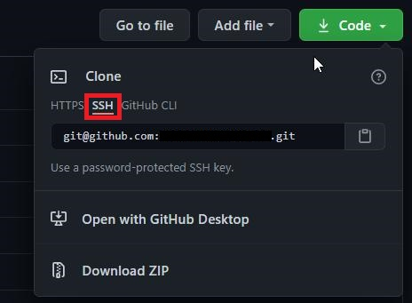
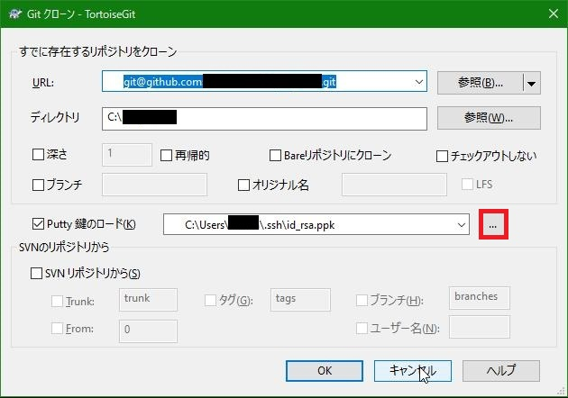

[トップに戻る](../index.md)

# インストール方法
1. Git msysgit をインストール
1. [こちら](http://code.google.coam/p/tortoisegit/wiki/Download)より、Git クライアントのインストールファイルと言語ファイルをダウンロード
1. Git クライアントのインストール
1. 言語ファイルのインストール (各サイトで日本語化方法を紹介しているが、最新版では日本語ファイルをインストールするだけで日本語化が可能)

# Tips
- [Push時、毎回認証画面が表示される対策](https://gist.github.com/stakiran/ab47411c1767e4e26b561925dbc2ddb3)
	1. Tortoise Gitの設定を開く（Git管理対象ファイルを右クリック→Setting）
	1. 「Git」→「全ユーザ共通設定を編集(Y)」を押下
	1. メモ帳にて開かれたgitconfig内の以下項目を変更して保存
		- 変更前：helper = manager
		- 変更後：helper = wincred
	1. 「Git」→「このユーザ共通設定を編集(O)」に対しても、上記と同様の設定を行う

- SSH鍵認証の方法＠Windows
	1. [SSH鍵生成＆アップロード](https://www.emb-se.com/?p=496)
	1. githubのページよりURL取得
		- URL取得時、「SSH」を指定する。
			
	1. gitクローン
		- 作成したid\_rsa.ppkファイルを指定してgitクローンする
			

[トップに戻る](../index.md)
