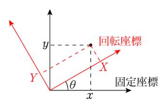

- モータ  
    - 電気と磁気  
        - 法則  
            - 右ねじの法則  
                - 意味  
                    - ”電流”を流した時の”磁界”の向き  
                        - ...  
            - フレミング左手の法則  
                - 意味  
                    - ”磁界”の中で”電流”を流した時の”力”の向き  
                          →モーターにおけるトルク方向がわかる  
                        - ...  
                - 覚え方  
                    - 電→磁→力（中指→人差し指→親指）  
            - フレミング右手の法則  
                - 意味  
                    - ”磁界”の中で”運動”した時の誘導”起電力”の向き  
                          →発電機の電流方向がわかる  
                        - ...  
                - 覚え方  
                    - 起→磁→動（中指→人差し指→親指）  
        - 電気と磁気  
            - リアクタンスとインダクタンス  
                リンク: [denken3.net/mail-magazine/mz20180223/][1]  
                - リアクタンス(reactance)  
                    - 流れる電流に変化があったとき、磁界の発生によってそれを妨げ、抵抗のように働く性質  
                    - 単位：Ω（オーム）  
                - インダクタンス(inductance)  
                    - コイルに流れる電流が変化したときに発生する逆起電力  
                    - 単位：H（ヘンリー）  
                        - 1ヘンリー＝1秒間に1Aの割合で電流が変化したとき，1Vの起電力を生じる  
            - インダクタ(inductor)  
                リンク: [sagami-elec.co.jp/file/tech/coil_doc_100j.pdf][2]  
                - コイルのなかで「巻線が一個」のもの  
            - リアクトル(reactor)  
                リンク: [kotobank.jp/word/%E3%83%AA%E3%82%A2%E3%82%AF%E3%83%88%E3%83%AB-148309][3]  
                - 概要  
                    - 交流回路にリアクタンスを生じさせる装置  
                - 種類  
                    - 限流リアクトル  
                        - 電力回路の短絡故障電流を抑制  
                    - 消弧リアクトル  
                        - 送電線の中性点接地  
                    - 分路リアクトル  
                        - 電力系統の無効電力調整  
                    - 始動リアクトル  
                        - 籠型誘導電動機の始動電流を制限  
            - リラクタンス(reluctance)  
                リンク: [weblio.jp/content/%E3%83%AA%E3%83%A9%E3%82%AF%E3%82%BF%E3%83%B3%E3%82%B9][4]  
                - 磁気抵抗  
                    - 磁気回路における磁束の流れにくさを表す度合い  
                    - 起磁力÷磁束  
        - 短絡電流  
            リンク: [indexpro.co.jp/article/detail/13/7][5]  
            - 各相コイル端子をGNDに短絡（ショート）し、モータには電気ブレーキ制動  
        - 電圧飽和  
            - ★  
        - DC電流  
            - 直流電流  
    - 三相同期電動機  
        - 相電流と線間電圧  
            リンク: [hegtel.com/three-phase-delta.html][6]  
            - 相電流  
                - 三相交流回路における3つの電源の電流のこと  
            - 線間電圧  
                - 負荷側へ延びている3本の電線のうち2本間の電圧差  
            - ...  
        - 電気角/機械角  
            - 電気角  
                - ステッピング・モータのコイルに流す交流電流の角度  
            - 機械角  
                - 実際にステッピング・モータが回転する角度  
            - ex)8極2相で、36枚の小歯を持つステッピング・モータの場合  
                - ある極に交流電流を一周期分（電気角を360度）流した時、実際にモータは360 度÷36枚＝機械角10度回転する。  
            - 3相4極  
                (極対数2)  
                - リンク: [youtube.com/watch][7]  
                    - ...  
            - 3相6極  
                (極対数3)  
                - ![][8]  
                    リンク: [mohno-dispenser.jp/compass/compass08.html][9]  
            - 3相8極  
                (極対数4)  
                - リンク: [youtube.com/watch][10]  
                    - ...  
            - ローターとステーターの極数は同じ  
        - 三相同期電動機  
            - ...  
            - ゲートドライバー  
                - リンク: [ameblo.jp/odamaki3/entry-12373760947.html][11]  
        - 界磁電流を変える理由  
            - ★  
        - 数学  
            - sin/cos  
                - 正弦/余弦  
                    - ![][12]  
                        - ![][13]  
                    - 正弦  
                        - 弦の長さを求めるためのもの  
                    - 余弦  
                        - 引いた弦の長さ  
                - ...  
                    - 正弦波  
                        - sin  
                    - 余弦波  
                        - cos  
            - ラジアン  
                - 角度の測り方の一種。弧度法とも言う。  
                - 孤の長さ(L)÷半径(r)  
                - r\*r*pi=円周  
        - 電機子  
            - 磁界を発生させる固定子または回転子のこと  
        - 負荷角  
            - ★  
    - 参考URL  
        - 同期機  
            リンク: [energychord.com/children/energy/motor/sync/contents/sync_principle.html][14]  
        - パーク変換法の導入  
            リンク: [denki-no-shinzui.com/3872/][15]  
        - クラーク変換法の導入  
            リンク: [denki-no-shinzui.com/502/][16]  
        - レゾルバオフセット調整の目的と方法  
            リンク: [ekouhou.net/%E3%83%A2%E3%83%BC%E3%82%BF%E5%88%B6%E5%BE%A1%E8%A3%85%E7%BD%AE/disp-A,2007-228700.html][17]  
        - モータの基礎と永久磁石  
            リンク: [neomag.jp/mailmagazines/topics/letter201003.html][18]  
        - 三菱電機製ベルト駆動式モータジェネレーター  
            リンク: [giho.mitsubishielectric.co.jp/giho/pdf/2016/1603113.pdf][19]  
    - サーボモーター  
        - 目標物に忠実にかつ素早く応答することを目的としたモータ  
        - Servus@ラテン語  
            - Slave@英語  
                - 奴隷  
    - レゾルバセンサ  
        - 概要  
            - モーターの角度と回転速度を検出するセンサー。取得した情報をもとに、モーターを細かく制御する。  
        - 構造  
            - ステータに2次側巻線として2つのピックアップ巻線を90°に配置。  
                リファレンス信号を加える1次側巻線もステータ上に配置し、ローターには中継用の巻線のみを搭載。  
                （ブラシ構造は持ちません）  
        - 検出までの流れ  
            - 1. リファレンス信号を1次側巻線へ加える。  
  
                1. ローターの巻線上に誘導される。  
                1. ステータ上の2つの2次側巻線には、ローターの角度に応じて、起電力が発生  
        - 参考URL  
            - 自動車の電動化（HEV&EV）コア技術 レゾルバ編  
                リンク: [ameblo.jp/odamaki3/entry-12373259657.html][20]  
            - シンクロ・モータとレゾルバの構造  
                リンク: [analog.com/jp/landing-pages/003/sensor_pv_jp/sensor_home_jp/sd_rd/sdrd_structure.html][21]  
            - レゾルバセンサについて  
                リンク: [minebeamitsumi.com/strengths/column/resolver/index.html][22]  
    - ベクトル制御  
        - 弱め界磁  
            リンク: [tech.nikkeibp.co.jp/dm/article/WORD/20090916/175328/][23]  
            - 界磁に永久磁石を用いたモータでは永久磁石の磁束が一定なので，回転数が上がるにつれて同磁束によって生じる逆起電力が増加する。  
                ある回転数に達すると，この逆起電力がモータの印加電圧と等しくなる。  
                それにより，モータには電流を流せなくなり，それよりも回転数を上げることができなくなる。これを防ぐために用い手法。  
            - マグネットトルクとリラクタンストルク  
                リンク: [ednjapan.com/edn/articles/1805/22/news006.html#utm_medium=email&utm_source=mn-ee&utm_campaign=20200806][24]  
        - 他の用語  
            - dq軸  
                - d：磁界成分  
                    - Direct  
                - q：トルク成分  
                    - Quadrature(直交)  
        - ...  
            - クラーク変換  
                - ３相→２相変換  
                    - Iu + Iv + Iw = 0  
                    - Iα= Iu  
                    - Iβ= (Iu + 2Iv) / &radic;3  
            - パーク変換  
                - 固定座標→回転座標 変換  
                    - Iq = －Iα・sinθ＋Iβ・cosθ  
                    - Id = ＋Iα・cosθ＋Iβ・sinθ  
            - 逆パーク変換  
                - 回転座標→固定座標 変換  
                    - Vα= Vd・cosθ－Vq・sinθ  
                    - Vβ= Vd・sinθ＋Vq・cosθ  
        - アンチワインドアップ  
            リンク: [hamachannel.hatenablog.com/entry/2019/01/06/135004][25]  
            - 積分器ワインドアップ(飽和)による制御性能の劣化を補償する方法全般  
        - 参考URL  
            - ベクトルエンジンとベクトル制御  
                リンク: [toshiba.semicon-storage.com/jp/design-support/e-learning/mcupark/village/vector-1.html][26]  
            - Clarke-Park 変換  
                リンク: [jp.mathworks.com/solutions/power-electronics-control/clarke-and-park-transforms.html][27]  
            - マイコン：モータ駆動用ベクトル制御技術  
                リンク: [youtube.com/watch][28]  
            - 固定座標から回転座標へ変換  
                リンク: [physics-school.com/rotate-coordinates-equation/][29]  
                -   
    - PWM制御  
        - 三角波比較方式  
            リンク: [energychord.com/children/energy/pe/inv/contents/inv_pwm_tri.html][30]  
            - 概要  
                - デジタル信号(PWM)からアナログ信号を生成するための方法  
                    - ...  
                - 時間軸方向に量子化されていないPWM信号が得られるため、デジタル方式PWM変調回路よりも解像度が高い  
                - キャリア周波数を下げると、モータ騒音が大きくなりますが、インバータから発生する高周波 ノイズや、漏れ電流を減らすことができます。  
                    リンク: [dl.mitsubishielectric.co.jp/dl/fa/document/catalog/gear/invertor/inverter.pdf][31]  
                    - キャリア周波数：低⇔高  
                        モータ騒音：大⇔小  
                        漏れ電流：小⇔大  
                        ノイズ：小⇔大  
            - URL  
                - [https://synapse.kyoto/glossary/pwm/page001.html][32]  
                - [http://energychord.com/children/energy/pe/inv/contents/inv_pwm_tri.html][33]  
  
[1]: https://www.denken3.net/mail-magazine/mz20180223/  
[2]: https://www.sagami-elec.co.jp/file/tech/coil_doc_100j.pdf  
[3]: https://kotobank.jp/word/%E3%83%AA%E3%82%A2%E3%82%AF%E3%83%88%E3%83%AB-148309  
[4]: https://www.weblio.jp/content/%E3%83%AA%E3%83%A9%E3%82%AF%E3%82%BF%E3%83%B3%E3%82%B9  
[5]: https://www.indexpro.co.jp/article/detail/13/7  
[6]: https://hegtel.com/three-phase-delta.html  
[7]: https://www.youtube.com/watch?v=Eh1YqFRSTnw  
[8]: http://www.mohno-dispenser.jp/img/compass/compass08/img_08_06.gif  
[9]: http://www.mohno-dispenser.jp/compass/compass08.html  
[10]: https://www.youtube.com/watch?v=Eh1YqFRSTnw  
[11]: https://ameblo.jp/odamaki3/entry-12373760947.html  
[12]: https://sites.google.com/site/cinderellajapan/_/rsrc/1363258953597/gao-xiao-shu-xue/san-jiao-bi/zheng-xian/sannkaku2.png  
[13]: https://sites.google.com/site/cinderellajapan/_/rsrc/1363258953597/gao-xiao-shu-xue/san-jiao-bi/zheng-xian/sannkaku4.png  
[14]: http://energychord.com/children/energy/motor/sync/contents/sync_principle.html  
[15]: https://denki-no-shinzui.com/3872/  
[16]: https://denki-no-shinzui.com/502/  
[17]: http://www.ekouhou.net/%E3%83%A2%E3%83%BC%E3%82%BF%E5%88%B6%E5%BE%A1%E8%A3%85%E7%BD%AE/disp-A,2007-228700.html  
[18]: https://www.neomag.jp/mailmagazines/topics/letter201003.html  
[19]: https://www.giho.mitsubishielectric.co.jp/giho/pdf/2016/1603113.pdf  
[20]: https://ameblo.jp/odamaki3/entry-12373259657.html  
[21]: https://www.analog.com/jp/landing-pages/003/sensor_pv_jp/sensor_home_jp/sd_rd/sdrd_structure.html  
[22]: https://www.minebeamitsumi.com/strengths/column/resolver/index.html  
[23]: https://tech.nikkeibp.co.jp/dm/article/WORD/20090916/175328/  
[24]: https://ednjapan.com/edn/articles/1805/22/news006.html#utm_medium=email&utm_source=mn-ee&utm_campaign=20200806  
[25]: https://hamachannel.hatenablog.com/entry/2019/01/06/135004  
[26]: https://toshiba.semicon-storage.com/jp/design-support/e-learning/mcupark/village/vector-1.html  
[27]: https://jp.mathworks.com/solutions/power-electronics-control/clarke-and-park-transforms.html  
[28]: https://www.youtube.com/watch?v=0Yd8qOfiWzQ  
[29]: https://physics-school.com/rotate-coordinates-equation/  
[30]: http://energychord.com/children/energy/pe/inv/contents/inv_pwm_tri.html  
[31]: https://dl.mitsubishielectric.co.jp/dl/fa/document/catalog/gear/invertor/inverter.pdf  
[32]: https://synapse.kyoto/glossary/pwm/page001.html  
[33]: http://energychord.com/children/energy/pe/inv/contents/inv_pwm_tri.html  
